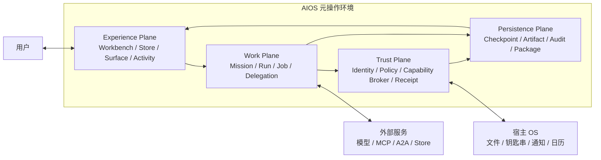
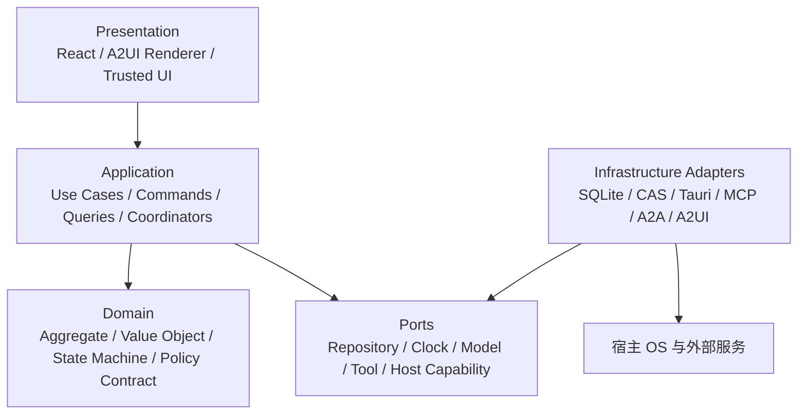
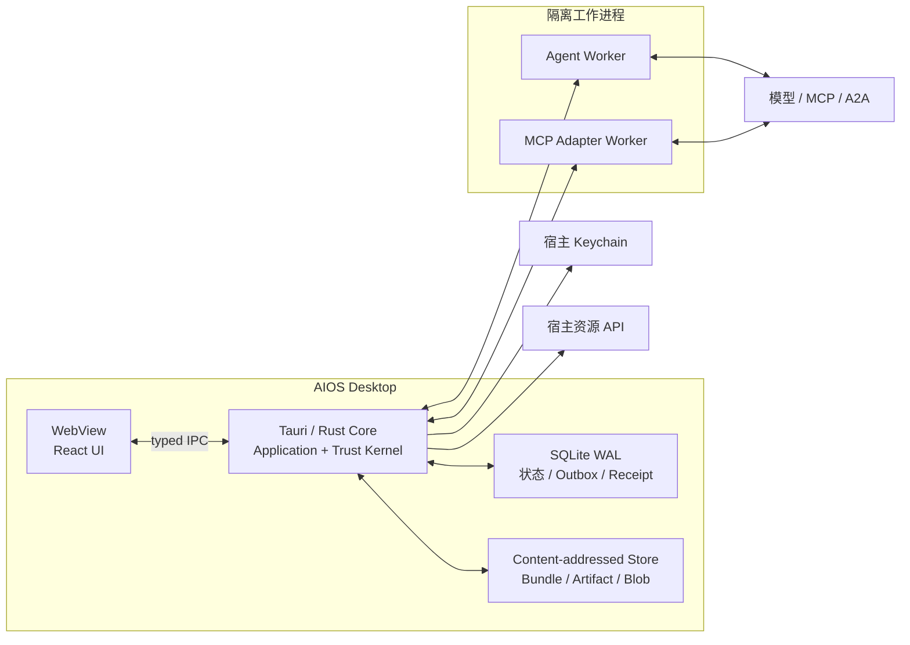
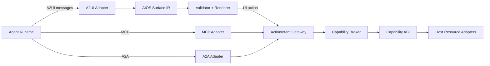

# AIOS 系统架构

> 状态：设计基线 v1
> 日期：2026-07-25
> 适用范围：演示纵向切片、桌面 MVP 与后续生产演进

## 1. 架构结论

AIOS 是运行在 macOS、Windows、Linux 等现有桌面操作系统之上的 **Agentic Operating Environment（面向 Agent 的元操作环境）**。它重新组织“安装能力、接收意图、编排工作、生成界面、访问系统能力、沉淀成果和审计副作用”这些操作系统级职责，但不自研内核、驱动、窗口服务器或硬件抽象层。

桌面 MVP 的目标拓扑是 Tauri 2 宿主、React/TypeScript 交互层与 Rust 系统核心组成的模块化单体；当前仓库先用 React/Vite 和确定性演示引擎交付可点击的纵向切片。演示引擎验证产品闭环，不充当真实模型执行、安全沙箱或生产 Capability Broker。

五条不可破坏的架构不变量：

1. Agent、Prompt、Skill、MCP、A2A 与 A2UI 都处在不可信 Agent Plane，只能提出请求。
2. A2UI 只描述 Agent Surface；MCP 只提供工具互操作；A2A 只承担 Agent 协作。三者都不是系统授权。
3. 文件、网络、账号、秘密、日历、通知等受保护能力只能经过 Capability Broker。
4. 高风险动作只能由系统可信界面确认，并绑定规范化交易摘要；Agent 不能自绘等价确认框。
5. 对外部世界产生副作用的成功结论必须由 Receipt 支撑；Artifact、Activity 或 Agent 文案不能替代 Receipt。

这些原则分别由 [ADR-0001](../decisions/0001-agentic-operating-environment.md)、[ADR-0002](../decisions/0002-protocol-and-abi-boundaries.md) 和 [ADR-0003](../decisions/0003-capability-broker.md) 固化。

## 2. 系统上下文



宿主 OS 仍负责进程、文件系统、设备、账户与平台安全设施。AIOS 在其上提供面向 Agent 的身份、安装、权限衰减、任务运行、动态 UI 与结果治理。任何外部服务的可用性下降不得破坏本地授权和审计结论。

## 3. 分层与依赖规则

代码采用 Ports and Adapters 与领域分层，依赖只能由外向内：



依赖纪律：

- Domain 不依赖 React、Tauri、数据库、外部协议 SDK 或网络类型。
- Application 只使用领域对象和端口，负责用例编排、事务边界与跨聚合一致性。
- Infrastructure 实现端口；外部 wire schema 必须在 Adapter 内归一化，不能渗入 Domain。
- Presentation 不直接调用 Tauri command、MCP tool 或宿主 API；所有副作用通过 Application → Capability Broker。
- Trusted Approval 属于 System Plane 独立入口，不在 Agent Surface 组件 Catalog 中注册。
- 模块间不读写彼此的数据表；跨模块协作使用公开命令、查询或不可变领域事件。

## 4. 模块化单体边界

首版不采用微服务。模块在一个桌面产品内发布，但拥有独立职责、接口、数据所有权和测试门槛。

| 模块 | 核心职责 | 拥有的数据 | 明确不负责 |
|---|---|---|---|
| `identity` | 用户、Agent 包、运行实例、MCP/A2A 对端身份 | Principal、Publisher、Runtime Identity | 业务任务编排 |
| `packages` | Bundle 验证、签名、摘要、依赖锁定、安装、更新与吊销 | Bundle、Installation、Install Lock、SBOM 引用 | 运行时授权 |
| `store` | 目录查询、审核元数据、版本可用性与安装发起 | Store Record、Review Evidence | 直接修改安装状态 |
| `missions` | Space、Mission、Run、Job、Delegation 状态机与预算 | Mission、Run、Job、Delegation、Checkpoint | 直接执行宿主能力 |
| `runtime` | 模型循环、Prompt/Skill 装配、工具与 Agent 协作调度 | Runtime Session、Invocation、Context Ref | 签发 Grant 或渲染可信确认 |
| `surfaces` | A2UI Adapter、AIOS Surface IR、Catalog 验证、差量更新与恢复 | Surface、Surface Revision、Action Binding | 直接执行 A2UI action |
| `capabilities` | ActionIntent 归一化、策略评估、Grant、审批、Resource Broker 与 Receipt | Grant、Decision、Prepared Transaction、Receipt | 信任 Agent 自报风险 |
| `artifacts` | 成果版本、内容摘要、来源链、预览与导出 | Artifact、Version、Blob Ref、Lineage | 把临时消息当成果 |
| `activity` | 用户可读的运行事件、Attention 与查询投影 | Activity Projection、Notification State | 作为权威审计账本 |
| `audit` | 追加式安全事件、序号、签名与对账 | Audit Entry、Revocation Receipt | 面向用户编辑 |
| `host` | Tauri IPC、文件/网络/账号/日历等资源适配器 | Platform Handle、Adapter Metadata | 自行决定授权 |

### 4.1 公开模块接口

模块通过小而稳定的用例接口协作，避免“共享 service 大对象”：

```text
PackageService.verifyAndInstall(bundleRef, spaceId) -> Installation
MissionService.start(command) -> RunId
RuntimeService.resume(runId, checkpointId) -> RuntimeEventStream
SurfaceService.apply(envelope, context) -> SurfaceRevision
CapabilityService.prepare(actionIntent) -> Decision | ApprovalChallenge
CapabilityService.commit(approvalToken) -> Receipt
ArtifactService.commit(draft, provenance) -> ArtifactVersion
AuditService.append(securityEvent) -> AuditSequence
```

接口返回类型化错误，不用自由文本区分业务分支。公开接口必须携带 `space_id`、`principal_id`、correlation ID 与适用的 `mission_id/run_id`，以保证隔离和归因。

## 5. 进程与部署拓扑

### 5.1 桌面 MVP



- React WebView 只持有展示状态和短期输入，不持有系统秘密或长期 Grant。
- Rust Core 是可信边界，承载领域状态、Policy、Broker、Receipt 与持久化事务。
- Agent Runtime 与第三方 MCP 以低权限 Worker 运行；崩溃只影响对应 Run，不影响 Trust Kernel。
- IPC 使用生成或共享 schema 的类型化命令；每条请求进行来源、版本、长度和权限验证。
- 数据库启用 WAL、外键、迁移版本与事务；密钥只存宿主 Keychain，数据库保存 opaque reference。
- Bundle 与 Artifact 大对象进入内容寻址存储，元数据与摘要进入 SQLite。

### 5.2 当前演示纵向切片

当前仓库使用 React/Vite 单页应用、Zustand 状态容器、`localStorage` 持久化和确定性定时状态机，以便无需模型密钥即可稳定演示 Agent Store → 安装 → Mission → A2UI → Trusted Approval → Artifact/Receipt。它遵守领域命名和 UI 边界，但具有限定语义：

| 演示实现 | 可证明 | 不可据此宣称 |
|---|---|---|
| 固定 Agent 目录与 digest | 安装体验、幂等安装、Agent 自定义图标 | 已完成真实签名、SBOM 与吊销校验 |
| 确定性 `demoEngine` | Mission/Job/A2UI/审批的交互时序 | 已运行真实模型、Skill、MCP 或 A2A |
| Zustand + `localStorage` | 刷新后稳定状态恢复 | 已实现加密数据库、崩溃一致事务 |
| 模拟 Receipt 与 effect key | UI 可展示回执和幂等概念 | 已执行真实宿主副作用或生成系统签名 |
| Web 可信审批视觉层 | Agent Surface 与系统确认的交互分层 | 浏览器 DOM 已构成不可伪造的系统安全边界 |

演示数据必须清楚标识 Demo，不使用真实账户、秘密或外部写能力。

## 6. 核心领域与聚合

### 6.1 Space

`Space` 是 Principal、安装、策略、Mission、Memory 和 Artifact 的租户隔离边界。所有 Repository 查询必须带 Space 条件；跨 Space 的 Artifact 分享必须形成显式 ActionIntent 和新 Lineage 边。

### 6.2 AgentDefinition、Bundle 与 Installation

三者不能合并：

- `AgentDefinition` 是逻辑契约与稳定身份。
- `Bundle` 是内容摘要标识、可签名验证的物理制品。
- `Installation` 是某 Space 对指定 digest 的启用记录。

安装只证明包被验证并可用，不自动签发运行时 Grant。更新产生新的 digest 和独立审核；回滚切回已验证 digest，不覆盖历史 Receipt 中的包身份。

### 6.3 Mission、Run、Job 与 Delegation

- `Mission` 表示长期用户目标和约束。
- `Run` 是一次可暂停、恢复、取消、重试的执行实例。
- `Job` 是带输入、输出、依赖、预算和状态的工作单元。
- `Delegation` 是带权限衰减和来源链的下游委托。

关闭窗口只改变窗口状态，不隐式取消 Run。Run 与 Surface 生命周期独立，通过 ID 关联。

### 6.4 Surface、Artifact 与 Receipt

- `Surface` 是可丢弃、可重建、受配额限制的任务交互投影。
- `Artifact` 是内容寻址、版本化且携带来源链的成果。
- `Receipt` 是 System Plane 对授权决定和真实副作用结果的不可变证据。

Surface 中显示“已完成”不能改变 Run；Artifact 不能证明外部写入成功；只有 Receipt 能支撑副作用的最终状态。

## 7. 协议与 ABI 边界



### 7.1 A2UI

AIOS MVP 冻结 A2UI v0.9.1 wire profile，通过官方 `@a2ui/react` / `@a2ui/web_core` 的 v0.9 兼容入口接收消息。Adapter 负责 schema、版本、来源、组件 Catalog、图完整性、资源限额和数据绑定校验，然后转换为 AIOS Surface IR。

A2UI action 只生成结构化用户意图；若涉及受保护能力，必须进入 Broker。Trusted Approval、密码、支付授权、系统权限授予等组件永不开放给 Agent Catalog。完整规则见 [AIOS UI Profile](../specs/ui-profile.md)。

### 7.2 MCP

MCP Adapter 负责工具/资源/提示词互操作、会话关联、结果 schema 与 provenance。工具描述不是授权策略；远程 MCP Server 是独立 Principal。任何宿主资源或外部副作用仍必须生成 ActionIntent 并进入 Broker。

### 7.3 A2A

A2A Adapter 负责 Agent Card 解析、任务通信与 Artifact 传递。对端自声明不能建立本地身份或权限。委托必须绑定父 Run、Principal chain、预算、有效期和衰减后的能力；远程 Agent 的返回内容进入 Content Plane。

### 7.4 Capability Broker 与 Capability ABI

Capability ABI 是稳定、类型化的系统能力契约，至少表达：主体、代理关系、资源、动作、selector、目的、目标、预算、前置条件、时效、幂等键和来源。Resource Adapter 只执行 Broker 已准备的交易，不能自行授权。详细对象和风险分级见 [Trust Kernel](./trust-kernel.md)。

## 8. 关键状态机

### 8.1 Run 与 Job

```mermaid
stateDiagram-v2
  [*] --> Planning
  Planning --> Running: plan committed
  Running --> AwaitingApproval: guarded action prepared
  AwaitingApproval --> Running: approved and more jobs remain
  AwaitingApproval --> Completed: approved and final receipt committed
  AwaitingApproval --> Running: denied; fallback exists
  Running --> Paused: user / budget / dependency
  Paused --> Running: resume from checkpoint
  Planning --> Failed: unrecoverable error
  Running --> Failed: retry budget exhausted
  Running --> Completed: outputs committed
  Failed --> Running: explicit retry creates new attempt
  Completed --> [*]
```



Job 采用 `queued → running → completed` 主路径，并可进入 `blocked`。失败重试创建 attempt，不覆盖历史。聚合只允许状态机定义的转换；UI 不能直接写 `completed`。

### 8.2 Surface

`absent → creating → active → suspended → deleted`。每次更新带单调递增 revision 与消息 ID；重复消息幂等收敛，缺号触发重新同步。Surface 删除不删除 Artifact 或 Receipt，恢复时优先用最新快照再增量应用事件。

### 8.3 受保护动作

`proposed → normalized → policy-evaluated → prepared → awaiting-approval → committed/rejected/unknown → reconciled`。确认绑定 prepared transaction digest 与过期时间；确认后参数变化必须重新准备和确认。非幂等调用超时进入 `unknown`，先对账，禁止盲目重试。

## 9. 命令、事件与一致性

### 9.1 命令与查询分离

- Command 表达单一意图并携带 idempotency key，例如 `InstallBundle`、`StartRun`、`PrepareAction`、`ApproveTransaction`。
- Query 读取专用投影，例如 Workbench、Activity、Mission Graph 和 Artifact Lineage。
- UI 乐观更新仅用于可逆的展示状态；授权、安装、Receipt 与 Artifact 版本必须等待核心确认。

### 9.2 本地事务与 Outbox

同一模块内状态变化、领域事件和 Outbox 在一个 SQLite 事务中提交。跨 Worker/远程投递采用至少一次语义；消费者以 event ID 去重。不能把消息发送成功当成本地事务提交，也不能用分布式两阶段提交锁住桌面应用。

### 9.3 关键原子边界

| 用例 | 同一事务内必须成立 |
|---|---|
| 安装 Agent | 验证结果、digest 锁定、Installation、审计事件 |
| 启动 Run | Run、初始 Job、预算预留、首个 Checkpoint、Outbox |
| 应用 Surface 更新 | 校验通过的 revision、数据快照摘要、Action binding |
| 准备高风险动作 | 规范化 ActionIntent、策略快照、prepared digest、审批 challenge |
| 提交副作用 | effect journal 状态转换、Receipt、审计序号；外部 unknown 状态可对账 |
| 提交 Artifact | 内容摘要、版本、Lineage、Run 输出引用 |

## 10. 持久化、恢复与幂等

### 10.1 存储布局

- SQLite：聚合元数据、状态机、安装锁、Checkpoint、Outbox、Receipt 索引和查询投影。
- 内容寻址存储：Bundle、Artifact、附件、Surface 快照；摘要校验后才可读取。
- 宿主 Keychain：签名密钥、OAuth refresh token 与 secret；领域数据只保存 opaque handle。
- 追加式 Audit Ledger：安全关键决定和副作用序列；生产版支持链式摘要与系统签名。

### 10.2 Checkpoint

Checkpoint 至少记录 Run/Job 状态、已消费输入、模型上下文引用、Surface revision、预算、未决 ActionIntent、effect journal cursor 与输出引用。只有成功落盘的 Checkpoint 可成为恢复点。

### 10.3 启动恢复

应用启动按以下顺序恢复：

1. 校验 schema 版本与数据库完整性，失败时进入只读恢复模式。
2. 重放已提交但未投影的 Outbox 事件。
3. 将无心跳的运行中 Worker 标记为 interrupted，不直接判定失败。
4. 对 prepared/unknown 副作用查询 Resource Adapter 或进入人工对账。
5. 恢复可继续 Run；重建 Surface；向用户暴露中断和恢复证据。

幂等边界以 `(principal, action, normalized_target, idempotency_key)` 和交易摘要标识。模型推理可以重试，但外部副作用只有 effect journal 明确为未提交时才可执行。

## 11. 安全与隔离

生产桌面 MVP 至少需要：

- Agent Worker 无环境凭证、无宿主文件系统默认访问、无任意 Tauri IPC。
- WebView 启用严格 CSP，不允许任意远程脚本；外部 URL 通过显式 allowlist 打开。
- Agent 包 digest 固定；安装验证、运行身份与 Receipt 均引用同一 digest。
- 所有跨信任边界数据按 schema、长度、深度、节点数、速率和超时限制。
- provenance/taint 标签在 MCP、A2A、Memory、Artifact 与 Surface 间粘性传播。
- 权限默认拒绝，Grant 短期、最小范围、audience-bound；委托只能衰减。
- 日志不写 Prompt 原文、token、secret 或用户敏感内容；诊断数据使用摘要与分类标签。

安全详细要求以 [Trust Kernel](./trust-kernel.md) 为准；本文件不降低其发布门槛。

## 12. 可观测性与故障模型

所有跨模块操作共享 `trace_id`，并保留 `space_id/mission_id/run_id/job_id/principal_id`。指标至少覆盖：

- Run 启动、成功、阻塞、恢复时延和失败类别。
- A2UI 消息拒绝率、渲染时延、revision 缺口和配额命中。
- Policy 决定、审批转化、Broker 提交、unknown 副作用与对账积压。
- Worker 崩溃、工具超时、模型成本与预算耗尽。
- 安装校验失败、吊销命中和 digest 不一致。

Activity 是面向用户的解释投影，telemetry 是运维信号，Audit/Receipt 是安全证据；三者不得混用。错误码稳定、可分类，用户文案可本地化但不能作为程序判断条件。

## 13. 质量属性与预算

| 属性 | MVP 门槛 |
|---|---|
| 启动 | 正常本地数据库下首个可交互窗口 ≤ 2.5 秒（P95，目标硬件） |
| UI 响应 | 本地直接操作反馈 ≤ 100 ms；长任务 300 ms 内展示可取消进度 |
| Surface | 合法小型增量 P95 应用 ≤ 50 ms；超限消息确定性拒绝 |
| 恢复 | 已落盘 Run 在重启后 10 秒内给出恢复/对账状态 |
| 幂等 | 同一审批摘要重复提交产生至多一个 committed effect |
| 可访问性 | 键盘可达、可见焦点、语义标签、对比度与 reduced-motion |
| 兼容 | 外部协议升级只修改 Adapter 与兼容测试，不修改核心领域语义 |
| 可测试 | Domain/Application 无 WebView 与网络即可确定性单测 |

性能门槛必须在指定硬件和数据规模上记录证据，不能用开发者主观感受代替。

## 14. 演进路线

### 14.1 阶段 A：演示纵向切片

React/Vite、固定目录、确定性 runtime 与浏览器持久化展示完整用户故事；实际复用 A2UI renderer、macOS 风格开源组件和 Mission DAG 组件，验证信息架构与交互语义。

### 14.2 阶段 B：生产桌面 MVP

引入 Tauri 2/Rust Core、SQLite/CAS、真实安装验证、隔离 Agent Worker、最小 Capability Broker、可信原生审批与恢复机制。只开放经过端到端安全验证的少量资源能力。

### 14.3 阶段 C：可扩展本地平台

支持真实模型、Skill、受控 MCP、A2A 委托、Agent SDK/TCK、更新与吊销、更多 Resource Broker。依然保持本地控制平面和模块化单体。

### 14.4 阶段 D：选择性拆分

只有当隔离、独立扩缩、故障域或团队所有权产生可量化需求时，才把 Agent Worker Manager、远程 Store 同步、遥测上传或企业 Policy Control Plane 拆成独立进程/服务。Identity、Policy、Broker 提交和本地 Receipt 保持在本地可信核心；拆分使用版本化契约与 Outbox，不共享数据库。

## 15. 架构符合性检查

任何新模块、协议或能力合入前必须回答：

1. 它属于哪个信任平面，谁是 Principal？
2. 它拥有哪些数据，公开什么端口，是否越过模块所有权？
3. 它是否访问受保护资源；若是，ActionIntent、Grant、Broker 与 Receipt 在哪里？
4. 外部 wire type 是否被 Adapter 隔离？
5. 重试、崩溃、重复消息和未知结果如何收敛？
6. 是否携带 Space、Run、来源、预算与审计关联？
7. Agent 能否伪造 Trusted UI、放大委托或绕过 Broker？
8. 模块可否在无网络、无 WebView 下进行确定性测试？

任一问题无明确答案，则能力不能进入生产 MVP。
