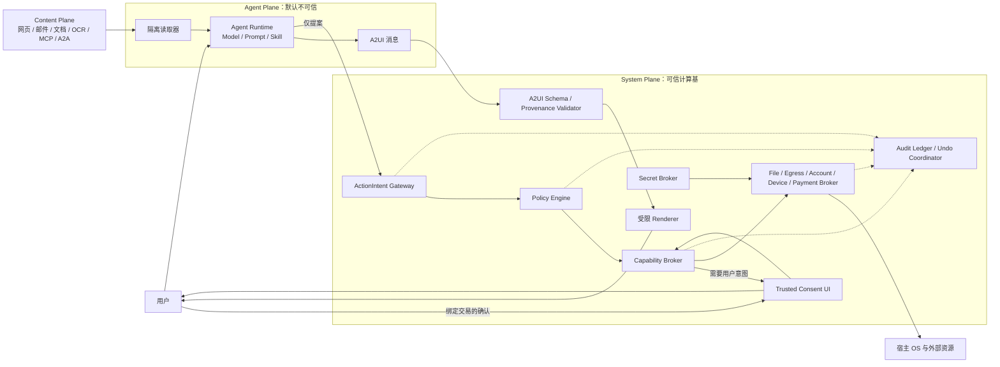
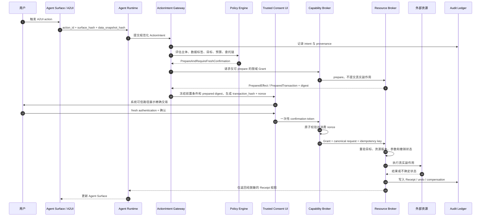

# AIOS Trust Kernel 安全架构

## 1. 文档状态与目标

本文定义 AIOS 的生产级安全边界、核心安全对象、架构接口、运行时约束与发布门槛。文中的“必须”“不得”是安全要求，不是实现建议。

AIOS 运行的不是行为固定的传统应用，而是会推理、读取不可信内容、调用外部工具、生成界面并继续委托的半自治主体。因此，Agent、模型、Prompt、Skill、MCP、A2A 消息和 A2UI 输出都不得成为授权依据。它们只能提出请求；只有 Trust Kernel 能授予并执行系统能力。

本文采用以下总原则：

> 默认拒绝、无环境权限、完整仲裁、权限不可放大、用户确认绑定精确交易、所有副作用可归因。

Trust Kernel 是逻辑安全内核，不要求 MVP 重写宿主操作系统内核。MVP 可以构建在成熟宿主 OS 之上，但所有宿主能力仍必须经过本文定义的 Broker。

## 2. 安全目标与非目标

### 2.1 安全目标

Trust Kernel 必须保证：

1. 即使 Agent 被恶意 Prompt 完全劫持，也不能获得未授予的权限。
2. 即使 A2UI、MCP 或下游 Agent 恶意，也不能伪造系统授权、绕过用户确认或扩大委托权限。
3. 文件、网络、账号、支付、秘密、设备和跨 Agent 调用只有一个系统入口：Capability Broker 及其 Resource Broker。
4. 每个真实副作用都能重建 `用户 → Agent → 子 Agent → MCP/工具 → 资源` 的责任链。
5. 授权、确认、执行、审计和撤销在并发、失败、重试和离线情况下保持一致。
6. Agent 的安装、更新、远程依赖变化与吊销均可验证、可阻断、可回滚或可隔离。

### 2.2 非目标

Trust Kernel 不承诺：

- 模型永远不产生错误、幻觉或有害建议。
- Prompt Injection 可以被语义检测器完全识别。
- 发布者签名能够证明 Agent 没有恶意。
- A2UI 的声明式格式本身能够防止钓鱼或社会工程。
- 审计可以撤销所有外部世界的不可逆操作。

安全架构必须在上述失败发生时仍阻止未授权副作用，并给出可调查证据。

## 3. 三个信任平面

AIOS 必须显式区分三个平面。数据或请求跨平面时必须保留来源，并经过策略检查。

### 3.1 System Plane

System Plane 是可信计算基，包含：

- Trust Kernel 与确定性 Policy Engine
- Capability Broker 与各 Resource Broker
- Principal、Grant、Delegation、Revocation 服务
- Secret Broker 与系统密钥存储
- Trusted Consent UI 与系统级来源标识
- A2UI 验证器和受限 Renderer
- 安装验证、更新、回滚与吊销服务
- 防篡改 Audit Ledger 与补偿/撤销协调器

只有 System Plane 可以签发 Grant、显示系统授权、访问真实秘密、调用宿主高权 API 或确认真实副作用。

### 3.2 Agent Plane

Agent Plane 默认不可信，包含：

- 模型与推理循环
- Prompt、Skill 和 Agent Memory
- 本地或远程 MCP Client/Server
- A2A Agent 与编排器
- Agent 生成的 A2UI 消息
- Agent 解释、风险说明和确认文案

Agent Plane 只能创建 `ActionIntent`。它不能签发 Grant、直接执行系统能力、渲染系统确认，或把自然语言“用户同意了”当作授权证据。

### 3.3 Content Plane

Content Plane 始终不可信，包含：

- 网页、搜索结果、邮件、附件和文档
- RAG 片段、数据库自由文本、日志与工单
- OCR、截图、图片、音频和视频识别结果
- MCP/tool 返回值和错误消息
- A2A 消息、其他 Agent 产物和用户粘贴内容

Content Plane 的文本不得直接变成系统指令。其来源和 taint 标签必须在摘要、缓存、Memory、Artifact、Clipboard、A2UI 和 Agent-to-Agent 传输中粘性传播。

## 4. 信任边界



安全边界的首要不变量是：

> Agent Runtime 与 A2UI Renderer 不得拥有绕过 Broker 的宿主权限；ActionIntent 不是能力，Grant 也不是副作用，只有通过 Resource Broker 的已授权执行才能改变真实世界。

## 5. 核心安全对象与接口

接口可以使用 Rust、TypeScript、Protobuf 或其他实现语言，但语义和必填字段不得弱化。

### 5.1 Principal

`Principal` 表示可以请求、持有或执行能力的安全主体。显示名称和图标不是身份。

```text
Principal {
  principal_id: StableId
  kind: User | AgentPackage | AgentInstance | MCPServer | RemoteAgent | System
  tenant_id: TenantId
  publisher_id?: PublisherId
  package_digest?: Digest
  runtime_digest?: Digest
  model_identity?: { provider, deployment, version }
  session_id?: SessionId
  workload_key_id?: KeyId
  trust_tier: System | FirstParty | VerifiedThirdParty | Unverified
  valid_from: Timestamp
  valid_until?: Timestamp
  status: Active | Suspended | Revoked
}
```

要求：

- Agent 包身份、发布者身份、安装实例身份和运行实例身份必须分离。
- 每个运行实例必须拥有短生命周期 runtime identity，不得共用长期高权密钥。
- 远程 MCP/A2A 必须验证传输对端身份，不能信任 Agent Card 或 tool description 的自声明。
- 所有策略决定必须使用不可变 ID 和摘要，不得仅使用名称、域名展示文本或图标。

### 5.2 Grant

`Grant` 是 System Plane 签发的限域授权。安装 Agent 不会自动产生 Grant；Manifest 权限仅表示最大请求范围。

```text
Grant {
  grant_id: GrantId
  subject: PrincipalId
  on_behalf_of: PrincipalId
  parent_grant_id?: GrantId
  audience: PrincipalId | ResourceBrokerId
  resource: ResourceType
  actions: Set<Action>
  selector: TypedSelector
  purpose: PurposeId
  data_labels: Set<DataLabel>
  destinations: Set<TypedDestination>
  constraints: {
    methods?: Set<Method>
    max_bytes?: UInt64
    max_records?: UInt64
    max_amount?: Money
    max_uses: UInt32
    rate_limit?: Rate
    write_set?: Set<ResourceHandle>
    cpu_ms?: UInt64
    wall_time_ms?: UInt64
    token_budget?: UInt64
    monetary_budget?: Money
  }
  validity: { not_before, expires_at }
  user_presence: None | Required | FreshAuthentication
  delegation: { allowed, depth_remaining, fanout_remaining }
  approval_hash?: Digest
  policy_snapshot_hash: Digest
  holder_key_id?: KeyId
  status: Active | Consumed | Expired | Revoked
}
```

要求：

- 未知 resource、action、selector、destination 或约束必须拒绝。
- `read`、`write`、`delete`、`share`、`execute`、`authorize` 必须拆分，不提供 `*`。
- 文件使用用户选择或系统生成的 handle，不向 Agent 暴露整棵路径树。
- 网络授权至少精确到 scheme、host、port、path 前缀和 method。
- Grant 不得包含原始 secret、refresh token、支付凭证或用户密码。
- 本地授权优先使用不可伪造 opaque handle；跨主机授权必须 audience-bound、短生命周期，并对高风险动作采用 holder-bound/proof-of-possession。

### 5.3 ActionIntent

`ActionIntent` 是 Agent 对系统动作的结构化提案，不是授权，也不能直接触发副作用。

```text
ActionIntent {
  intent_id: IntentId
  requesting_principal: PrincipalId
  principal_chain: List<PrincipalId>
  user_intent_hash: Digest
  action: TypedAction
  target: TypedTarget
  parameters: CanonicalParameters
  preconditions: {
    expected_resource_version?: Version
    if_match_etag?: String
    expected_write_set_digest?: Digest
    predicates: List<TypedPredicate>
  }
  input_provenance: List<ProvenanceRef>
  input_taint_labels: Set<DataLabel>
  requested_destinations: Set<TypedDestination>
  expected_effect: EffectPreview
  reversibility: Reversible | Compensatable | Irreversible
  risk_level: R0 | R1 | R2 | R3 | R4
  budget_request: Budget
  surface_binding?: { surface_hash, action_id, data_snapshot_hash }
  created_at: Timestamp
  expires_at: Timestamp
  nonce: Nonce
  idempotency_key: IdempotencyKey
}
```

要求：

- 参数必须被规范化并使用确定性编码；自由文本不能作为高风险动作的唯一参数。
- R2 以上写操作必须包含类型化前置条件，至少绑定资源版本、ETag、数据快照或预期 write-set；不支持前置条件的资源不得执行需要防并发覆盖的高风险写操作。
- `risk_level` 由 System Plane 重新计算，Agent 提供的值只能作为提示。
- 高风险 ActionIntent 必须含用户原始意图引用、完整来源、精确目标、预期差异和可逆性。
- 来自 A2UI 的 ActionIntent 必须绑定 surface、action 和数据快照。
- Intent 过期、来源缺失、参数无法规范化或策略评估失败时必须拒绝。

### 5.4 Receipt

`Receipt` 是 System Plane 对真实执行结果的不可变证据。副作用动作没有 Receipt 时不得报告为成功。

```text
Receipt {
  receipt_id: ReceiptId
  intent_hash: Digest
  grant_id: GrantId
  policy_decision_id: DecisionId
  principal_chain: List<PrincipalId>
  resource_broker_id: ResourceBrokerId
  tool_identity?: PrincipalId
  request_digest: Digest
  effect_status: Committed | Rejected | Failed | Unknown | Compensated
  rejection_code?: PreconditionFailed | Revoked | Expired | PolicyDenied | Replay | Conflict
  effect_summary: StructuredEffect
  result_digest?: Digest
  confirmation_hash?: Digest
  cost_usage: BudgetUsage
  committed_at: Timestamp
  resource_version_after?: Version
  undo_handle?: OpaqueHandle
  compensation_handle?: OpaqueHandle
  audit_sequence: UInt64
  system_signature: Signature
}
```

要求：

- Receipt 必须进入 append-only Audit Ledger，Agent 不能修改或删除。
- 非幂等操作出现超时或网络断开时，状态必须为 `Unknown` 并进入对账，不得盲目自动重试。
- 可逆动作必须提供 undo handle；可补偿动作必须提供 compensation handle；不可逆动作必须在确认前明确展示。

### 5.5 RevocationReceipt

`RevocationReceipt` 证明撤销请求已经由 System Plane 执行，并记录其级联范围。

```text
RevocationReceipt {
  revocation_id: RevocationId
  target: PrincipalId | GrantId | PackageDigest | ToolDigest
  reason: RevocationReason
  requested_by: PrincipalId
  requested_at: Timestamp
  effective_at: Timestamp
  cascade_root?: GrantId
  revoked_descendant_count: UInt64
  revoked_descendant_digest: Digest
  terminated_runtime_count: UInt64
  invalidated_token_count: UInt64
  invalidated_handle_count: UInt64
  quarantined_artifact_count: UInt64
  compensation_status: NotRequired | Pending | Completed | Failed
  audit_sequence: UInt64
  system_signature: Signature
}
```

撤销不能只更新商店状态。`effective_at` 表示本地 Broker 已开始拒绝新请求的时刻；无法联机确认的远程低风险 Grant 只能依靠短 TTL 限制失效窗口。

### 5.6 Broker 接口

所有 Broker 使用统一调用语义：

```text
authorize(intent, principal, policy_snapshot) -> Decision
prepare?(grant_handle, canonical_request) -> PreparedEffect
issue_grant(decision, confirmation?) -> GrantHandle
execute(grant_handle, canonical_request) -> Receipt
revoke(grant_or_principal, reason) -> RevocationReceipt
inspect(receipt_or_grant) -> RedactedAuditView
```

首批 Resource Broker：

- `FileBroker`：文件/目录 handle、快照、读写、版本和回滚
- `EgressBroker`：DNS、HTTP(S)、下载、上传和数据外发
- `AccountBroker`：OAuth、邮件、日历、联系人和第三方账号
- `DeviceBroker`：剪贴板、摄像头、麦克风、屏幕、位置和通知
- `SecretBroker`：秘密存储、opaque handle 和短期凭证交换
- `PaymentBroker`：prepare、approve、execute、receipt 分离
- `DelegationBroker`：Agent-to-Agent Grant 衰减、验证和级联撤销

Broker 必须在资源侧执行最终授权，不能仅在 Agent 调用前做一次前置检查。

`prepare` 只能读取并冻结执行所需状态、计算 diff/报价和生成摘要，不能提交真实副作用。Resource Broker 在 `execute` 时必须重新验证 `ActionIntent.preconditions`；任一前置条件不满足时不得降级为 best-effort，必须返回 `Rejected/PreconditionFailed` Receipt。

### 5.7 PreparedTransaction

支付属于专用的 R4 两阶段协议，不能只复用通用自然语言确认。`PaymentBroker.prepare` 必须返回：

```text
PreparedTransaction {
  prepared_transaction_id: PreparedTransactionId
  source_intent_hash: Digest
  prepare_grant_id: GrantId
  provider_identity: PrincipalId
  merchant_or_payee_binding: TypedPayee
  amount: Money
  fee: Money
  currency: Currency
  funding_instrument_handle: OpaqueHandle
  quote_digest: Digest
  quote_expires_at: Timestamp
  risk_context_digest: Digest
  nonce: Nonce
  provider_signature?: Signature
}
```

支付确认和执行 Grant 必须绑定整个 `PreparedTransaction` 摘要，而不是只绑定最初的 ActionIntent。商户/收款人、金额、费用、币种、资金工具、报价或期限任一变化都必须重新 prepare 和确认。`prepare` 不得扣款；`execute` 不得接受另一个 prepared transaction 的确认 token；资金工具始终是 Secret Broker 管理的 opaque handle。

## 6. Capability 风险等级

| 等级 | 示例 | 默认策略 |
|---|---|---|
| R0 | 纯计算、安全 A2UI 展示、读取 Agent 私有临时区 | 配额内自动允许 |
| R1 | 读取用户明确选择的普通 Artifact、写入私有草稿 | 单任务、短生命周期 Grant |
| R2 | 可回滚文件写入、选定账号数据读取、剪贴板读取 | 上下文确认；持久授权仅能由 Policy Console 创建 |
| R3 | 对外发信/分享、批量导出、摄像头/麦克风、删除 | 系统逐笔确认；禁止静默后台执行 |
| R4 | 支付、转账、凭证、安全设置、数字签名、不可逆删除 | fresh authentication、精确交易绑定、默认不可委托 |

用户在 Agent Surface 中说“以后都允许”不能创建 R2 以上的持久授权。持续自动化策略必须在独立的 System Plane `Policy Console` 中创建，明确对象、目的地、预算、期限和撤销入口。

## 7. Broker 是唯一系统能力入口

### 7.1 完整仲裁

Agent Runtime 不得直接获得以下宿主能力：

- 任意文件描述符、宿主主目录或全盘路径
- 任意 socket、DNS、localhost、私网或云 metadata 访问
- 用户主账号 refresh token、cookie、SSH/Git/云密钥
- 摄像头、麦克风、屏幕、位置、剪贴板原始 API
- 支付凭证、系统设置、安装器或提权 API
- 向其他 Agent 直接转交 bearer token 的通道

宿主适配层必须使 Broker 成为唯一可达路径。策略检查失败、审计不可写、撤销状态未知或 Broker 不可用时必须 fail closed。

### 7.2 运行时隔离

- 第三方 Skill 和工具优先运行在 capability-based Wasm/WASI 沙箱中。
- 必须兼容原生 MCP 时，使用独立微虚拟机或多层内核沙箱；只读根文件系统、非 root、系统调用过滤、无设备节点、无 `ptrace`、无 mount、无 raw socket，并设置 CPU、内存、进程、网络和时限配额。
- 原生 MCP 不得继承 AIOS 主进程环境变量或宿主凭证。
- 容器不能作为唯一安全边界。
- Runtime 终止时必须回收其打开的 handle、临时 Grant、短期 token 和未提交事务。

## 8. 可信确认、防 TOCTOU 与防重放

高风险确认必须由独立 System Plane 进程渲染。Agent 和 A2UI 只能请求显示确认，不能控制其布局、文案来源、按钮、window level、系统徽章或确认结果。

系统确认必须展示：

- 发起用户、Agent、子 Agent、MCP/工具及发布者身份
- 精确动作、目标、收件人/商户、金额、记录数量和数据目的地
- 文件或对象 diff、当前资源版本和预期副作用
- 输入数据来源、taint、是否由外部内容触发
- 可撤销、可补偿或不可逆
- 预算、成本、有效时间和委托链

确认文案必须由 System Plane 从类型化参数生成，不得采用 Agent 提供的自然语言摘要作为权威内容。

### 8.1 高风险调用时序



### 8.2 交易绑定

`transaction_hash` 至少覆盖：

```text
intent_id
+ user_intent_hash
+ requesting_principal
+ principal_chain
+ canonical action/target/parameters
+ typed preconditions
+ input provenance and data labels
+ destination
+ amount/write-set/budget
+ resource version or data snapshot
+ prepared effect/transaction digest, if any
+ surface_hash/action_id
+ policy_snapshot_hash
+ expiry
+ nonce
```

任何字段变化都必须使确认失效并重新展示。确认 token 必须：

- 一次性使用并由 Broker 原子消费
- 绑定 holder、audience、设备会话和 transaction hash
- R3/R4 有效期不超过 5 分钟
- 禁止复制给下游 Agent
- 在撤销、策略版本变化、资源版本冲突或用户会话锁定后立即失效

Resource Broker 必须在副作用发生前重新检查全部类型化前置条件，防止“确认 A、执行 B”。前置条件、prepared digest、quote 或资源版本不匹配时，必须在产生副作用前返回 `Rejected/PreconditionFailed` Receipt。非幂等请求必须使用系统生成的 idempotency key；结果不确定时进入对账，不能自动重复扣款、发信或删除。

## 9. Agent-to-Agent 委托

委托必须显式，默认 `delegation.allowed = false`。A2A 或 MCP 的身份声明不能自动产生委托权。

对子 Grant，系统必须证明：

```text
child.actions             ⊆ parent.actions
child.selector            ⊆ parent.selector
child.destinations        ⊆ parent.destinations
child.data_labels         不得降低分类
child.constraints         比 parent 相同或更严格
child.expires_at          ≤ parent.expires_at
child.max_uses            ≤ parent.remaining_uses
child.budget              ≤ parent.remaining_budget
child.depth_remaining     < parent.depth_remaining
child.fanout_remaining    ≤ parent.remaining_fanout
child.user_presence       不得弱化
```

其他要求：

- 不能把用户或上游 Agent 的 bearer/refresh token 直接转交下游。
- 跨主机子授权必须 audience-bound、holder-bound，并携带 `subject`、`actor`、`parent linkage`、期限、约束和策略快照。
- R4 默认不可委托；R3 只有用户预先创建的明确政策才能委托。
- 默认最大委托深度为 2 层，或 3 层含根 Agent；默认 fan-out 不超过 4。
- 交互式子 Grant 默认不超过 5 分钟；后台批处理不超过 15 分钟，并必须支持在线撤销。
- 根 Grant 撤销时，整棵子树必须失效。
- 数据标签和 provenance 必须进入签名 envelope；分布式 tracing baggage 只能携带不透明引用，不能作为安全事实。

每个副作用 Receipt 必须保留完整 principal chain，不能把子 Agent 行为扁平化为“用户执行”。

## 10. Provenance、Taint 与 Memory

### 10.1 数据标签

最小分类：

| 标签 | 含义 | 默认外发策略 |
|---|---|---|
| D0 Public | 可公开数据 | 仍需目标网络 Grant |
| D1 Personal | 普通个人/组织数据 | 仅允许任务声明的目标 |
| D2 Sensitive | 私有通信、联系人、位置、摄像头、私有文档 | 默认禁止新目标外发；需精确确认 |
| D3 Restricted | 凭证、支付、身份材料、生物识别、系统密钥 | 原文不得进入 Agent 上下文；仅类型化操作或 opaque handle |

Provenance 至少记录：

- 来源类型、URI/资源 handle、内容摘要和获取时间
- 创建或提供内容的 Principal
- tenant、session、purpose、retention 和 consent 引用
- 经历的 Agent、工具、摘要、转换与 declassification 活动

### 10.2 粘性传播

- 摘要、复制、格式转换、压缩、写文件、写 Memory、A2UI data model 和 Agent-to-Agent 转发不会自动移除 taint。
- 结构化提取可以减少传递字段，但不能自动降低剩余字段的数据等级。
- 只有 System Plane 的受信 declassifier 可以降低标签；D2/D3 降级需要明确策略，必要时需要用户确认并产生 Receipt。
- Content Plane 不得直接驱动 R3/R4 行为。系统必须根据原始用户意图、结构化 ActionIntent 和数据流重新授权。
- LLM 注入检测器、双模型复核或内容清洗只能作为检测层，不能签发 Grant 或覆盖 Policy Engine。

### 10.3 Memory 隔离

- Memory 必须按 tenant、user、agent、purpose 和 session 分区。
- 外部内容默认只进入任务级临时 Memory，不自动晋升为长期 Memory。
- 长期 Memory 写入必须记录来源、标签、TTL 和写入 Principal，并允许用户查看、删除和导出。
- 被吊销 Agent 写入的 Memory 必须可定位、隔离和重新评估。

## 11. Secret Broker

Secret Broker 是秘密的唯一持有者和使用入口。

必须满足：

- refresh token、API key、支付 token、cookie、私钥和系统凭证不得进入 Prompt、Memory、A2UI、Agent 日志、错误消息或普通环境变量。
- Agent 只获得 opaque handle 或短生命周期、最小 scope、audience-bound 的 access token。
- 高风险远程 token 必须 sender-constrained；资源端验证 issuer、audience、tenant、期限、holder 和用途。
- MCP token passthrough 被禁止。每个 MCP server 必须拥有独立 audience 和用户同意记录。
- STDIO MCP 仅获得当前调用所需的最小化临时凭证，不继承 AIOS 或用户的完整环境。
- Secret handle 不可序列化到 Artifact、Clipboard 或 Agent-to-Agent 消息。
- Runtime 终止、Grant 撤销或用户锁屏后，相关 handle 和短期 token 必须失效。
- 审计只记录 secret 引用和使用结果，不记录秘密明文。

## 12. Egress Broker

新安装 Agent 默认没有网络能力。所有出站连接经过 Egress Broker，不提供任意 socket。

网络 Grant 至少约束：

- scheme、host、port、path 前缀、method
- 目标账号或服务租户
- DNS/IP 范围、重定向策略和 TLS 要求
- 请求/响应最大大小、速率、总字节和预算
- 允许携带的数据标签、字段和用途

Egress Broker 必须：

- 默认阻断 localhost、loopback、RFC1918、link-local、保留地址和云 metadata endpoint。
- 在解析和连接阶段校验地址；DNS 变化、重绑定和每次 redirect 都重新授权。
- 默认只允许生产 HTTPS，并验证证书和服务身份。
- 禁止未授权 DNS 隧道、raw socket、WebRTC/QUIC 和入站监听。
- 对上传、URL 参数、header、错误和工具返回执行数据标签与大小策略。
- 将下载内容写入隔离区并保留 provenance；不直接执行或自动信任。

域名 allowlist 不是充分条件。允许域名中的攻击者账号、搜索框、邮件主题和 URL 参数仍可成为数据外泄通道，因此 Egress Broker 必须同时验证目的地、数据标签和用途。

## 13. A2UI 不属于授权边界

A2UI 是 Agent 表达界面的声明式协议，不是系统权限 API。A2UI 的安全价值是避免直接执行模型生成的任意 UI 代码；它不能防止钓鱼、误导确认或恶意业务逻辑。

AIOS 必须执行：

- Agent Surface 与 System UI 在进程、window level、视觉 token、系统徽章和输入通道上硬隔离。
- 权限、账户、支付、安装、密钥、Policy Console 和 fresh authentication 只能由 System Plane 渲染。
- 每个 Agent Surface 始终显示不可伪造的来源：Agent、发布者、版本、验证状态和外部内容来源。
- A2UI action 只能产生 ActionIntent，不能直接调用 File、Egress、Secret、Account、Device 或 Payment Broker。
- 第三方 Catalog 只允许纯展示、输入和无副作用本地函数；有系统副作用的 client-side function 不向 Agent 暴露。
- 未知组件、属性、事件和 URL scheme 必须拒绝。
- 自定义可执行组件必须作为独立、签名、审核、沙箱化的系统扩展安装，不能随 A2UI 消息下载。
- Streaming UI 先进入 staging validator；用户操作绑定 surface hash 与数据快照，防止 bait-and-switch。
- Renderer 限制节点数、深度、字符串长度、更新频率、图片大小和解码资源。
- 清理 bidi、Unicode confusable、零尺寸/隐藏文本、欺骗性 accessibility label 和系统图标仿冒。
- 图像在独立解码沙箱中处理；第三方图标规范化并剥离活动内容和元数据。

A2UI Renderer 可以属于 TCB 的显示子系统，但 A2UI payload、Agent Catalog 请求和由其产生的 ActionIntent 永远不可信。

## 14. Audit、Receipt、撤销与补偿

### 14.1 Audit Ledger

必须记录：

- 用户原始 intent hash
- Principal、包、Runtime、模型、Prompt、Skill、MCP 和 Catalog 摘要
- ActionIntent、provenance、taint 和目标
- Policy Decision、Grant、委托链和确认哈希
- Broker 请求摘要、真实 effect、结果状态和资源版本
- Receipt、undo/compensation handle、成本和预算消耗
- 拒绝、撤销、超时、重放和策略失败事件

Audit Ledger 必须 append-only、可校验顺序和完整性，并对 Agent 只提供经脱敏的视图。日志不可写时，高风险操作必须 fail closed。原始秘密不得写入审计。

### 14.2 撤销

撤销 Principal、包、Grant、Skill、MCP 或发布者后，系统必须协调：

1. Broker 立即拒绝新的 capability invocation。
2. 终止或暂停相关 Runtime 和后台任务。
3. 级联撤销全部子 Grant 与委托。
4. 回收 access token、refresh token、secret handle 和文件/设备 handle。
5. 隔离缓存、Memory、下载物和未提交产物。
6. 对已执行的可逆动作调用 undo，对可补偿动作进入补偿流程。
7. 生成 RevocationReceipt，并在用户界面提供影响范围。

高风险远程动作必须在线检查撤销状态；低风险离线 Grant 通过短 TTL 限制最大失效窗口。

## 15. 安装、更新与供应链

Agent 分发物的签名必须覆盖一个内容寻址 Manifest，其至少包含：

- Prompt、Skill、MCP manifest/二进制及依赖锁
- MCP endpoint、tool/resource schema 和 tool description 摘要
- A2UI Catalog、可用函数、图标、名称和本地化资源
- 请求能力、网络目的地、数据使用、保留和隐私声明
- 模型/provider/deployment 策略
- SBOM/Agent BOM、构建 provenance 和安全评估版本

安全规则：

- 发布者签名证明来源，不等于安全审核通过。
- Prompt、Skill、MCP schema/tool description、endpoint 或 Catalog 变化都视为行为变化，必须重新签名和评估。
- 新增权限、网络目的地、数据等级或第三方依赖时，必须重新取得授权。
- 更新系统必须防止 rollback、freeze、mix-and-match 和错误包安装。
- 支持分阶段发布、健康检查、回滚、根密钥轮换、阈值签名和紧急吊销。
- 远程 MCP/A2A 的实际服务身份必须在运行时验证，不能只验证安装包中的 URL。
- 系统名称、图标和徽章使用保留命名空间；商店执行 Unicode 同形和品牌仿冒检测。

推荐复用成熟规范和实现：Sigstore/透明日志用于发布身份与签名，SLSA/in-toto 用于构建 provenance，TUF 用于安全更新，CycloneDX/SPDX 用于依赖和 AI 资产清单。不得自行发明密码算法。

## 16. MVP 安全范围与发布门槛

MVP 的目标不是“先没有安全，之后再补”，而是在受限能力范围内建立完整安全闭环。

### 16.1 MVP 允许范围

- 仅运行仓库内置、第一方签名并显式 allowlist 的 Agent。
- 不执行任意第三方原生 MCP；远程 MCP 仅允许第一方固定 endpoint/schema，且走 Broker。
- 仅开放 R0、R1，以及可完整回滚、具备资源版本前置条件的少量 R2。基线 MVP 的 R2 仅限 staged Artifact/文件写入。
- 文件访问仅限用户明确选择的 handle、Agent 私有区和任务工作区。
- 网络默认关闭；需要网络的第一方 Agent 使用固定目的地和数据标签策略。
- 不开放支付、凭证读取、安全设置、系统级删除、无人值守外发和 R4 委托。
- 基线 MVP 不开放 Account、Device 和 Payment Broker 能力；若产品演示启用其中任何资源类型，对应 Broker、确认、Receipt、撤销和测试不变量立即成为 MVP 必选门槛。
- 委托默认关闭；确有需要时仅允许第一方、单跳、短生命周期、权限衰减的调用。
- A2UI 使用系统提供的受限 Catalog；不加载第三方自定义可执行组件。

### 16.2 宣称 MVP 完成前必须实施

以下是 MVP 已实施门槛，缺一项都不能宣称安全闭环完成：

1. Principal、Grant、ActionIntent、Receipt 以及 RevocationReceipt 对象和持久标识已经实现。
2. 所有 MVP 实际开放的资源类型都经过对应 Broker；至少包括文件、网络、秘密和 Agent 调用。若开放账号、设备或支付能力，Account、Device 或 Payment Broker 同时纳入本门槛。不存在 Agent 直连任何宿主能力的路径。
3. Policy Engine 默认拒绝，未知权限或策略错误会 fail closed。
4. A2UI action 只能产生 ActionIntent，System UI 与 Agent Surface 已硬隔离。
5. ActionIntent 绑定 surface/action/data snapshot、资源前置条件和 prepared digest；重放、参数切换、资源版本冲突和跨 prepared object 复用确认都会失败。
6. 外部内容具有基础 provenance/taint，摘要和 Artifact 不丢失标签。
7. Secret 不进入 Prompt、A2UI、日志或普通环境变量。
8. Egress 默认关闭，已阻断 loopback、私网、metadata 和未授权 redirect。
9. 所有副作用均产生 Receipt；可回滚 R2 提供 undo handle。
10. Principal/Grant 撤销能够终止运行、回收 handle 并阻止后续调用。
11. CPU、内存、token、调用次数、网络字节和 wall time 有硬上限。
12. 自动化测试覆盖本文第 18 节全部 MVP 不变量。

### 16.3 MVP 禁止伪装为已完成的能力

- 仅有“Allow/Reject”弹窗但没有 Grant 与交易绑定，不算可信确认。
- 仅记录 Agent 文本日志但没有 Receipt，不算审计。
- 仅有域名 allowlist 但 Agent 可使用 raw socket，不算 egress 控制。
- 仅在 Prompt 中要求“不要泄密”，不算 Secret/Taint 防护。
- 仅验证 Agent 包签名但不固定 Prompt/MCP schema，不算供应链完整性。

## 17. 第三方 Agent 商店开放门槛

开放任意第三方 Agent、Skill、MCP 或自定义 Catalog 前，除 MVP 门槛外还必须满足：

1. 第三方执行强沙箱和独立第三方渗透测试通过；原生兼容层属于单独高风险等级。
2. 发布者验证、全包签名、透明日志、SBOM/Agent BOM、构建 provenance 和安全更新链已经上线。
3. Prompt、Skill、MCP schema/tool description/endpoint、Catalog 和权限变化能够自动生成安全差异并触发复审或重新授权。
4. Runtime workload identity、跨主机 holder-bound token、每 MCP audience 隔离和禁止 token passthrough 已实施。
5. Delegation Broker 对 scope、selector、TTL、预算、深度、fan-out、数据标签和用户 presence 执行单调衰减。
6. Sticky taint 覆盖 Memory、Artifact、Clipboard、A2UI、MCP 和 A2A 边界；D2/D3 外发由 Egress Broker 拦截。
7. System UI 保留命名空间、图标/名称仿冒检测和 Streaming UI 防 bait-and-switch 已验证。
8. 紧急吊销可停止安装、阻止加载、终止 Runtime、撤销子树、回收 token 并隔离产物。
9. 商店审核含静态分析、沙箱动态行为、权限/目的地检查、Prompt Injection 与数据外泄红队测试。
10. 安全指标达到第 18 节的 Store Gate，且接受独立外部评估。

在这些条件完成前，系统可以演示“安装第一方 Agent”，但不得把它描述为已具备安全的开放第三方 Agent 商店。

## 18. 可测试安全不变量与验收标准

| ID | 不变量 | 自动化验收 | 门槛 |
|---|---|---|---|
| TK-INV-001 | Broker 是唯一系统能力入口 | 系统调用、host bridge 与网络追踪中，未经过 Broker 的成功访问为 0 | MVP |
| TK-INV-002 | 默认拒绝 | 对所有未知 capability、selector、destination、组件和策略错误，拒绝率 100% | MVP |
| TK-INV-003 | ActionIntent 无副作用 | fuzz/单元测试中，未签发 Grant 的 Intent 真实副作用成功数为 0 | MVP |
| TK-INV-004 | 确认绑定精确交易 | 修改任一目标、参数、前置条件、prepared digest、数据快照、surface、策略版本或 nonce 后，旧确认失效率 100% | MVP |
| TK-INV-005 | 防重放 | 同一 confirmation token/Grant use 再次提交的成功数为 0 | MVP |
| TK-INV-006 | 委托单调衰减 | 属性测试生成至少 1,000,000 条父子 Grant，权限放大成功数为 0 | Store |
| TK-INV-007 | Taint 粘性传播 | 覆盖摘要、Memory、Artifact、A2UI、MCP、A2A 的转换测试中，未授权标签丢失数为 0 | MVP 基础；Store 全链路 |
| TK-INV-008 | Secret 不暴露 | Canary secret 在 Prompt、A2UI、日志、环境、错误和未授权外发中的出现数为 0 | MVP |
| TK-INV-009 | Egress 默认拒绝 | SSRF、DNS rebinding、redirect 到 loopback/私网/metadata 的成功数为 0 | MVP |
| TK-INV-010 | A2UI 不是授权路径 | A2UI fuzz 中直接调用系统能力、伪造系统确认或执行任意代码的成功数为 0 | MVP |
| TK-INV-011 | Receipt 完整 | 真实副作用拥有 Principal chain、Intent、Grant、Decision、Effect 和 Audit sequence 的覆盖率 100% | MVP |
| TK-INV-012 | 撤销级联 | 本地撤销 p99 小于等于 1 秒；高风险远程撤销 p99 小于等于 30 秒；撤销后成功调用为 0 | MVP 本地；Store 全链路 |
| TK-INV-013 | 数据分区 | 跨 tenant、user、agent 私有区越权访问成功数为 0 | MVP |
| TK-INV-014 | 资源预算不可绕过 | 隐藏子 Agent、无限递归、重试风暴均不能突破 CPU、token、时间、费用、深度和 fan-out 上限 | MVP 基础；Store 全量 |
| TK-INV-015 | 更新不可降级/拼接 | rollback、freeze、mix-and-match 和错误包攻击成功数为 0 | Store |
| TK-INV-016 | 高风险动作在模型失陷后仍安全 | 至少 10,000 个对抗场景中，未授权 R3/R4 副作用成功数为 0 | Store；MVP 对已开放动作同标准 |
| TK-INV-017 | 前置条件失败不产生副作用 | 资源版本、ETag、write-set 或 typed predicate 不匹配时，副作用成功数为 0，`PreconditionFailed` Receipt 覆盖率 100% | MVP |
| TK-INV-018 | 支付 prepare 与 execute 同一对象 | 将 A 交易的确认用于 B 交易，或修改 payee、金额、费用、币种、资金工具、报价、期限后执行，成功数为 0 | 启用 PaymentBroker 时强制 |

补充验收：

- A2UI payload schema 验证覆盖率 100%；未知组件/属性/函数拒绝率 100%。
- Store Gate 前至少执行 1,000,000 个 A2UI 结构、事件、Unicode、资源耗尽和 streaming fuzz payload；任意代码执行、系统 chrome 伪造和直接高权调用成功数为 0。
- 商店包签名、内容摘要、透明日志、SBOM 和 provenance 校验覆盖率 100%。
- 高风险远程 token 的 audience、issuer、tenant、holder、期限与活性校验覆盖率 100%。
- 可逆动作 rollback 成功率目标不低于 99.9%；不可逆动作确认提示覆盖率 100%。
- Audit Ledger 完整性破坏、顺序重排和删除测试检出率 100%。

Prompt Injection 检出率可以作为检测质量指标，但不能作为安全发布指标。发布标准是：即使模型服从恶意内容，权限仍不扩大，秘密仍不外泄，未授权副作用仍为 0。

## 19. 关键架构不变量

实现和评审必须持续维护以下不变量：

1. **Authority is not appearance**：名称、图标、自然语言、A2UI 外观和 Agent Card 都不产生权限。
2. **ActionIntent is not authority**：Agent 只能提案，System Plane 才能授权和执行。
3. **No ambient authority**：没有 Broker，就没有文件、网络、账号、设备、支付或秘密访问。
4. **Complete mediation**：每次资源访问都在资源侧验证当前 Grant、策略和撤销状态。
5. **Delegation only attenuates**：任何子委托都不能扩大权限、数据等级、预算、期限、深度或用户 presence。
6. **Confirmation is transaction-bound**：用户确认的是不可变、一次性、可验证的精确交易，不是 Agent 的解释。
7. **Taint is sticky**：不可信来源不会因摘要、存储、转发或渲染而自动变可信。
8. **Secrets remain opaque**：Agent 永远不需要看到秘密明文才能使用受控能力。
9. **A2UI is expression, not authority**：A2UI 负责表达界面，不能成为系统授权和副作用通道。
10. **Every effect has a receipt**：真实副作用必须可归因、可审计，并明确可逆性。
11. **Revocation closes the whole chain**：撤销必须同步关闭 Runtime、Grant、子委托、token、handle 和未完成事务。
12. **Failure is closed**：策略、身份、审计、撤销或 Broker 状态不确定时，不执行高风险动作。

## 20. 标准依据

本文的协议与实现选择应优先复用成熟标准：

- A2UI：声明式 UI、客户端受信 Catalog 与宿主渲染安全边界
- MCP 2025-11-25：授权、安全最佳实践、confused deputy、token passthrough 与 SSRF 防护
- A2A：传输身份与 Agent Card；授权仍由 AIOS Trust Kernel 完成
- OAuth 2.0 Token Exchange RFC 8693、OAuth Security BCP RFC 9700、DPoP/mTLS：跨服务委托与 sender-constrained token
- WebAssembly/WASI capability model：第三方 Skill 与工具的最小权限运行时
- Sigstore、SLSA、in-toto、TUF、CycloneDX/SPDX：签名、provenance、安全更新和资产清单
- NIST AI RMF、NIST SP 800-207 与 OWASP Agentic/MCP 指引：零信任、Agent 风险和对抗测试

引用标准不替代本文的不变量。若外部协议无法表达精确授权、委托衰减、可信确认或撤销语义，AIOS 必须在 Trust Kernel 中补齐，而不是降低安全要求。
