# AIOS 演示用户故事与验收剧本

> 本文定义当前演示必须可见、可点击、可重复的产品闭环。真实模型推理、MCP/A2A 调用、宿主日历写入和开放第三方商店不在本轮实现范围；这些步骤由确定性 Demo Engine 模拟，但 UI 状态机、A2UI renderer、可信确认、Artifact、Receipt 与 Activity 的关系必须真实呈现。

## 1. 演示目标

观众应在约三分钟内理解一件事：传统桌面通过安装 App 扩展功能，AIOS 通过安装 Agent、组织 Mission、渲染 Agent 请求的 A2UI Surface，并在系统级可信边界内提交副作用来扩展能力。

端到端主线：

```mermaid
flowchart LR
    Store["Agent Store"] --> Inspect["检查 Agent Package 声明"]
    Inspect --> Install["校验并安装 Agent"]
    Install --> Workbench["Workbench 选择对象与意图"]
    Workbench --> Mission["Mission DAG 运行"]
    Mission --> A2UI["Agent 自主生成 A2UI Surface"]
    A2UI --> Intent["高风险 ActionIntent"]
    Intent --> Approval["Trusted Approval"]
    Approval --> Commit["确定性提交"]
    Commit --> Artifact["Artifact + Receipt"]
    Artifact --> Activity["可审计 Activity"]
```



### 1.1 主要角色

- **演示用户**：需要用三份业务资料生成管理层简报并安排复盘；不需要理解 Prompt 或 MCP 实现；
- **Briefing Architect Agent**：演示用第一方、固定 digest 的 Agent；声明技能、协议和能力风险；
- **AIOS System Plane**：拥有安装、System Chrome、Trusted Approval、状态持久化和 Receipt 的最终控制权；
- **Demo Engine**：用短时定时器模拟 planning、running、awaiting approval 和 completed，不模拟真实外部副作用。

### 1.2 统一前置条件

```gherkin
Given 开发服务器已启动并可在支持的桌面浏览器访问
And 浏览器允许 localStorage
And 演示数据中包含 Briefing Architect 与三个示例对象
When 用户点击系统壳中的 Reset Demo
Then 当前 Mission、安装记录、Artifact 和 Receipt 被清空
And Workbench 显示可开始的全新演示状态
```

## 2. US-01：浏览 Agent Store

**价值**：把传统“App Store 找软件”重构为“检查并选择能力主体”。

```gherkin
Given 用户位于 AIOS Workbench
When 用户点击侧栏或 Workbench 中的 Agent 商店入口
Then 系统打开 Agent Store
And 显示 Agent 名称、自定义图标、发布者、分类、评分、安装量与 verified 状态
And featured 区突出 Briefing Architect
And 搜索框可以按 Agent、技能、协议、能力描述或发布者过滤
And 分类过滤可以在效率、调研、数据、沟通和出行之间切换
```

```gherkin
Given Agent Store 中存在多个 Agent
When 用户搜索 "briefing" 或选择某个分类
Then 列表只保留匹配项
And 选中项的详情面板仍展示 Package version、digest、Skills、Protocols 与 Capabilities
And 清空搜索或切回 All 后完整清单恢复
```

**验收标识**：`DEMO-STORE-001`、`DEMO-STORE-002`。

## 3. US-02：理解并安装 Agent Package

**价值**：明确“安装 Agent”不等于授予无限系统权限。

```gherkin
Given Briefing Architect 尚未安装
And 用户已在 Store 查看其能力声明
When 用户点击安装
Then 系统打开安装 Sheet
And 显示发布者、版本、固定 digest、技能、协议和能力激活方式
And 安装流程依次显示 verifying、installing、committing
And 完成后 Agent 出现在 AIOS 能力区
And Activity 新增 Agent installed 事件
And 系统返回 Workbench
```

```gherkin
Given Briefing Architect 已安装
When 用户再次尝试安装同一 Agent
Then 系统识别相同 agentId 和 digest
And 不创建重复的 InstalledAgent 记录
And UI 明确显示已安装或安装已完成
```

```gherkin
Given 用户正在查看安装 Sheet
When 用户检查能力列表
Then read-selected-artifacts 等低风险能力显示为显式选择或自动范围
And calendar-write 等高风险能力显示 trusted-approval 激活方式
And 文案不声称安装已经授予文件、账号、网络或 Secret 权限
```

**验收标识**：`DEMO-INSTALL-001`、`DEMO-INSTALL-002`、`DEMO-INSTALL-003`。

## 4. US-03：从对象和意图发起 Mission

**价值**：Workbench 以对象和任务为中心，而不是以空聊天框为中心。

```gherkin
Given Briefing Architect 未安装
When 用户进入 Workbench
Then Create Mission 动作不可用
And 界面解释需要先安装 Agent
And 提供直接进入 Agent Store 的动作
```

```gherkin
Given Briefing Architect 已安装
And Workbench 显示 Q3-results.pdf、Product-roadmap.md、Customer-signals.csv
When 用户勾选一个或多个对象
And 编辑或选择一个示例意图
Then UI 显示当前对象范围
And Mission 只能使用这些显式选中的对象
And Agent、输出意图与预算状态在提交前可见
```

```gherkin
Given Agent 已安装、对象非空且意图非空
When 用户点击 Create Mission
Then 系统创建唯一 Mission
And 状态从 planning 进入 running
And Mission DAG 显示每个 Job 的 Agent、依赖、进度、状态和细节
And Activity 记录 Mission started 与后续状态变化
```

**验收标识**：`DEMO-WORKBENCH-001`、`DEMO-WORKBENCH-002`、`DEMO-MISSION-001`。

## 5. US-04：观看 Mission DAG 推进

**价值**：让“自主运行”成为可观察、可解释的工作图，而不是一个旋转加载图标。

```gherkin
Given 用户已经发起简报 Mission
When Demo Engine 推进确定性时间线
Then DAG 节点依次从 queued 进入 running 或 completed
And 节点显示任务名、Agent、进度与当前细节
And 画布支持平移、缩放和聚焦查看
And Workbench 总进度与 Mission 状态同步更新
```

```gherkin
Given Mission 到达需要日历写入的 Job
When 高风险动作尚未获批
Then 相关 Job 显示 blocked 或等待确认
And Mission 状态为 awaiting-approval
And 系统不生成完成 Receipt
And 系统不声称已创建真实日历事件
```

当前演示时间线约在启动后 `160ms / 380ms / 620ms / 860ms` 推进关键状态，用于快速展示，不代表生产 Agent 的执行 SLA。

**验收标识**：`DEMO-DAG-001`、`DEMO-DAG-002`。

## 6. US-05：Agent 通过 A2UI 自主生成任务界面

**价值**：展示 Agent 不携带整套 App UI，而是用 A2UI 请求由 AIOS 客户端原生渲染的 Surface。

```gherkin
Given Mission 状态为 planning 或 running
When Demo Engine 向官方 A2UI message processor 发送 createSurface、component update 和 data model update
Then AIOS 使用 @a2ui/react v0_9 renderer 渲染 Surface
And Surface 明确标记 Agent-authored surface 与 A2UI v0.9.1
And Surface 内容随 Mission 状态更新
And AIOS System Chrome、导航和可信确认仍由宿主控制
```

```gherkin
Given Agent Surface 中存在操作按钮
When 用户点击该按钮
Then renderer 发出受限 UI action
And AIOS 将其视为无副作用 ActionIntent
And 任何高风险真实动作必须转入 Trusted Approval
And A2UI 组件本身不能直接写日历、读文件或生成 Receipt
```

```gherkin
Given A2UI payload 无法被官方 processor 接受或引用未知组件
When Surface 更新失败
Then AIOS 显示安全失败状态
And 不执行任意脚本或降级为不受控 HTML
And System Chrome 与其他 Mission 状态保持可用
```

**验收标识**：`DEMO-A2UI-001`、`DEMO-A2UI-002`、`DEMO-A2UI-003`。

## 7. US-06：在不可伪造的 Trusted Approval 中确认动作

**价值**：证明 Agent 可以提案，但不能自己授予权限或伪造系统确认。

```gherkin
Given Mission 进入 awaiting-approval
When Agent 请求创建下周一 30 分钟复盘日程
Then AIOS 显示系统拥有的 Trusted Approval Sheet
And Sheet 展示 requesting Agent 与 publisher
And 展示精确 action、target、time、data shared、risk 和 bound digest
And Sheet 的视觉层级与 A2UI Surface 明确区分
And Agent 不能修改 Sheet 内容或 Approve 按钮语义
```

```gherkin
Given Trusted Approval Sheet 正在显示
When 用户点击 Deny
Then 当前提案不被提交
And 不创建 completed Receipt
And 不产生声称副作用成功的 Artifact
And UI 返回可继续或重置的安全状态
```

```gherkin
Given Trusted Approval Sheet 显示固定 digest
When 用户点击 Approve exact action
Then 系统只批准当前展示的精确交易
And 同一 effect key 最多提交一次
And Mission 进入 completed
And 系统生成 Artifact 与 completed Receipt
```

**验收标识**：`DEMO-APPROVAL-001`、`DEMO-APPROVAL-002`、`DEMO-APPROVAL-003`。

## 8. US-07：检查 Artifact 与 Receipt

**价值**：把 Agent 输出从一次性消息升级为有版本、来源和责任链的成果。

```gherkin
Given 用户批准了精确动作
When 系统完成确定性提交
Then 导航进入 Artifacts
And 页面显示简报标题、版本、创建时间、摘要与 highlights
And 显示 Mission 中显式选中的 source objects
And Lineage 依次展示 Mission scoped、Agent surface adapted、Receipt committed、Artifact versioned
```

```gherkin
Given Artifact 已生成
When 用户检查 Receipt
Then Receipt 至少显示 action、principal、policy、result、timestamp、digest 与 effect key
And Receipt 的 missionId 与 Artifact 的 missionId 一致
And 重复批准或重新渲染不能为同一 effect key 生成第二个完成副作用
```

```gherkin
Given 尚未批准高风险动作
When 用户打开 Artifacts
Then 页面显示空状态
And 不伪造 Artifact、版本或 Receipt
And 文案提示需要完成可信确认
```

**验收标识**：`DEMO-ARTIFACT-001`、`DEMO-RECEIPT-001`、`DEMO-ARTIFACT-002`。

## 9. US-08：通过 Activity 理解整个责任链

**价值**：让安装、运行、阻塞、批准和提交成为用户可读的审计时间线。

```gherkin
Given 用户完成了主演示旅程
When 用户打开 Activity
Then 事件按时间倒序显示
And 每个事件显示时间、标题、详情、Agent 或 AIOS system 来源
And warning 事件标记为 Paused for trusted approval
And success 事件标记为 Committed with receipt
And 页面不会把普通观察事件误标成已提交副作用
```

```gherkin
Given Activity 包含多个事件
When 用户在 Store、Workbench、Artifacts 与 Activity 之间切换
Then 事件列表保持一致
And 导航不会隐式终止或重复 Mission
```

**验收标识**：`DEMO-ACTIVITY-001`、`DEMO-ACTIVITY-002`。

## 10. US-09：刷新后恢复稳定 checkpoint

**价值**：展示已提交责任链可恢复，同时证明浏览器持久化不能伪造系统可信确认。

```gherkin
Given Mission 已进入 awaiting-approval
When 用户刷新浏览器
Then 已安装 Agent 从 localStorage 恢复
And 未签名的 Mission 与 ApprovalRequest 被 fail-closed 丢弃
And 用户必须重新发起 Mission 才能得到新的系统可信确认
And 刷新本身不创建 Receipt 或副作用
```

```gherkin
Given Mission 已 completed 且 Artifact 与 Receipt 已生成
When 用户刷新浏览器
Then Artifact、Receipt、Activity 和完成态 Mission 恢复
And 同一 effect key 不重复提交
```

演示仅恢复已验证的安装记录、`completed` Mission、Artifact、Receipt 与 Activity；`planning`、`running`、`awaiting-approval` 和 ApprovalRequest 都不会作为可信授权状态恢复。这样本地存储被篡改时不能借系统面板提交伪造动作。真实跨进程恢复属于 Tauri 2/Rust Runtime 的签名 Checkpoint 里程碑。

**验收标识**：`DEMO-RECOVERY-001`、`DEMO-RECOVERY-002`。

## 11. 三分钟主讲脚本

| 时间 | 操作 | 观众应看到 | 必须讲清的概念 |
|---|---|---|---|
| 0:00–0:25 | 从 Workbench 打开 Agent Store | macOS 风格桌面壳、Agent 目录和自定义图标 | AIOS 用 Agent 而非 App 扩展能力。 |
| 0:25–0:55 | 打开 Briefing Architect 并安装 | digest、Skill、协议、风险与三阶段安装 | 安装 Package 不等于自动授权。 |
| 0:55–1:20 | 选择三个对象并创建 Mission | 对象架、Intent、预算和 Agent | Mission 有明确范围，不是无限上下文聊天。 |
| 1:20–1:50 | 观察 DAG 和动态 Surface | Job 推进、官方 A2UI renderer 更新 UI | Agent 描述 UI，AIOS 原生渲染并保留控制权。 |
| 1:50–2:20 | 检查并批准日历动作 | 系统 Trusted Approval、精确参数和 digest | A2UI 不是权限路径，Agent 只能提案。 |
| 2:20–2:45 | 查看 Artifact/Receipt | 来源、Lineage、effect key | 每个真实副作用都应有 Receipt。 |
| 2:45–3:00 | 打开 Activity 并刷新 | 完整责任链和稳定状态恢复 | 工作可观察、可恢复、可审计。 |

## 12. 演示完成定义

只有同时满足以下条件，才可宣称“演示级 AIOS 纵向闭环完成”：

- `DEMO-STORE-*` 到 `DEMO-RECOVERY-*` 的主路径可在真实浏览器重复执行；
- Store、Workbench、A2UI、Trusted Approval、Artifact、Receipt 与 Activity 使用同一状态模型，不是互不相干的静态页面；
- macOS 风格组件实际来自开源 LiqUIdify，并通过 `ui-system` 适配层使用；
- A2UI Surface 实际经过官方 message processor/React renderer，不是仅用普通 JSX 冒充；
- Deny 不提交，Approve 精确提交一次，刷新不重复 effect；
- 无 Agent 时、无对象时、无 Artifact 时和 A2UI 拒绝时都有明确安全状态；
- typecheck、unit test、production build 与主浏览器旅程通过；
- 演示文案始终区分“确定性模拟”和“真实 Agent/MCP/宿主能力”，不把未实现能力包装成已完成。
