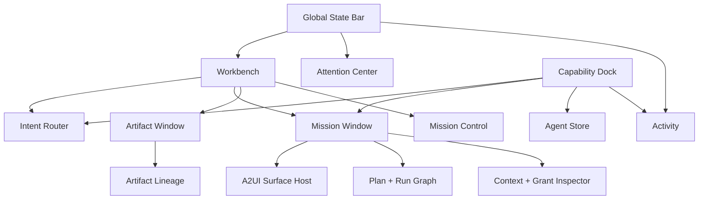
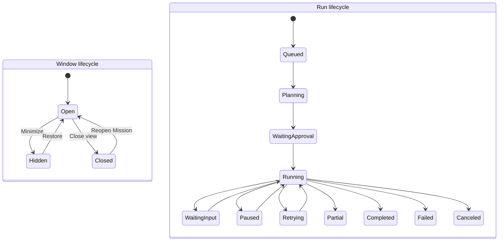
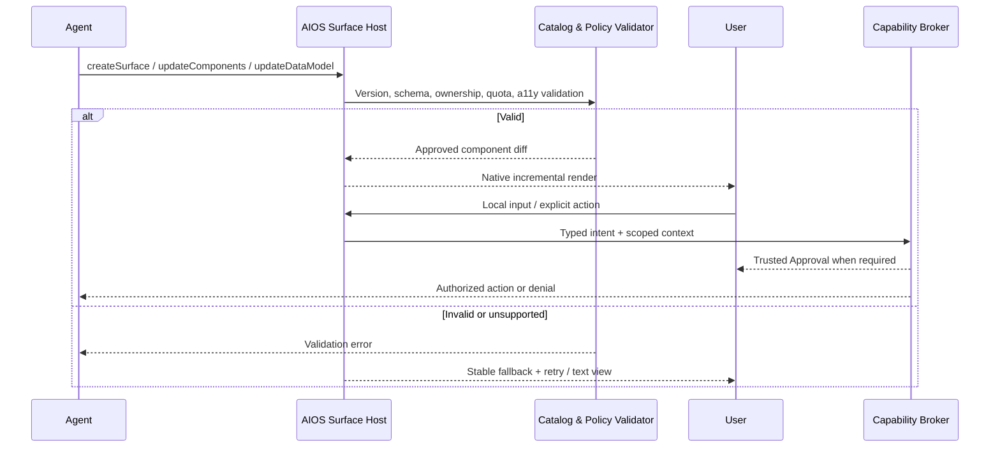
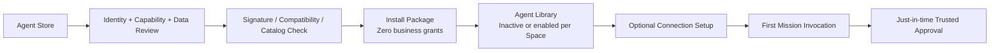
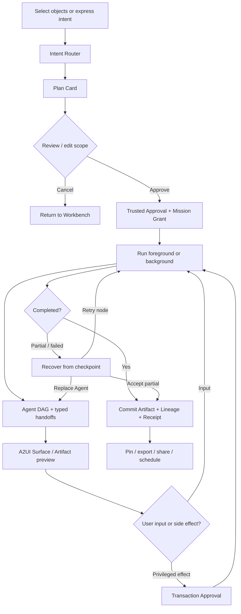

# AIOS 桌面体验规范

> 目标：定义 AIOS MVP 的核心桌面体验，使用户能够通过空间、对象、计划、可信审批、动态界面和持久产物与 Agent 协作，而不是被迫把所有工作压缩成聊天。

## 1. 体验主张

AIOS 借鉴 macOS 的清晰层级、空间连续性、顶部菜单栏、底部 Dock、窗口操纵和克制动效，但不复制其像素、图标、材质、文案或品牌资产。熟悉的桌面骨架用于降低学习成本，AI-native 的对象模型用于改变工作方式。

体验由三层组成：

1. **Direct Manipulation**：选择、拖拽、框选、右键、预览和编辑明确对象；
2. **Intent**：通过 Intent Router 表达 Find、Ask、Create、Act、Automate 等目标；
3. **Deliberation**：只在需求模糊、方案权衡或解释需要时进入对话侧栏。

用户的主循环是 `Select → Plan → Approve → Run → Inspect → Commit`，不是 `Open chat → Type → Wait → Copy answer`。

## 2. 全局体验架构



### 2.1 信息层级

- **Global**：用户身份、当前 Space、Intent Router、Attention、Activity、同步、隐私和计算状态；
- **Space**：Workbench、成员、Agent、Artifact、连接、Memory 和 Policy；
- **Mission**：目标、计划、Run、Handoff、审批、Surface、Artifact 和 Receipt；
- **Object**：单个 Artifact、Agent、Grant、Automation、Job、Connection 或 Activity Event 的详情。

任何界面都必须让用户在两步内回答：我在哪个 Space、当前对象是什么、什么仍在运行、下一步需要我做什么。

## 3. 视觉语言：macOS 启发而非像素克隆

### 3.1 保留的体验品质

- 顶部全局状态、底部能力 Dock、可重叠窗口和多 Space；
- 窗口层级清晰，进入/退出具有空间连续性；
- 以内容为中心，系统 Chrome 克制，常用动作可由键盘完成；
- 统一图标容器、圆角、阴影和动效节奏；
- Light、Dark 与 High Contrast 同时设计，不做简单颜色反转。

### 3.2 明确不复制的内容

- 不使用 Apple 标识、SF Symbols 专有资产、Finder 表情、系统壁纸或逐像素布局；
- 不复刻 macOS 菜单名称和所有交互细节；AIOS 以 Mission、Run、Artifact、Grant 和 Agent 为核心；
- 不用大面积磨砂玻璃、荧光渐变或“AI 光晕”掩盖信息层级；
- 不允许 Agent 自定义整张 Surface 的品牌色和系统级视觉样式。

### 3.3 设计 Token 原则

- 使用 4/8pt 间距体系；主要间距等级为 8、12、16、24、32、48；
- 正文不小于 14px，长文本行宽控制在 60–75 个拉丁字符或约 30–42 个汉字；
- 正文对比度至少 4.5:1，大号文本和关键图形至少 3:1；
- 微交互 150–240ms，复杂窗口过渡不超过 400ms；退出比进入更快；
- Agent Accent 只用于图标、身份 Chip 和 Lineage 标记，不用于 Trusted Approval 或系统状态；
- 图标使用统一矢量风格；Agent 可提供自定义图标，但系统负责统一安全留白、圆角容器和信任徽章。

### 3.4 不可伪造的系统层

System Chrome、Trusted Approval、Agent 安装、Secret、支付、账号连接和不可逆动作使用保留的窗口层级、图形标识和色彩 Token。A2UI Surface 无法调用这些 Token，也不能覆盖其来源栏。

## 4. Workbench

Workbench 是当前 Context Space 的桌面，不是传统文件倾倒区，也不是一个巨大的聊天框。

### 4.1 内容组成

- **Continue**：最近 Mission，按运行、阻塞、暂停和已完成分组；
- **Pinned Artifacts**：置顶产物与 Artifact Stack；
- **Attention**：需要批准、补充、冲突处理或失败恢复的请求；
- **Recent Activity**：最近的 Agent、工具、Artifact 和共享操作；
- **Space Context**：当前成员、连接、预算和 Context Shelf 摘要；
- **Suggestions**：由系统基于当前选择和历史提供的可解释建议，不自动执行。

### 4.2 Workbench 文字线框

```text
┌──────────────────────────────────────────────────────────────────────────────┐
│ AIOS  Board Space ▾     ⌘K Intent Router       ● 2 Attention   ◌ Activity  │
├──────────────────────────────────────────────────────────────────────────────┤
│ Context Spaces  Board / Research / Personal                         + Space │
├───────────────────────┬───────────────────────────────────┬──────────────────┤
│ CONTINUE              │ PINNED ARTIFACTS                  │ ATTENTION        │
│ ┌───────────────────┐ │ ┌────────────┐ ┌───────────────┐ │ [Approve] Export │
│ │ Q3 board brief    │ │ │ Board deck │ │ Revenue model │ │ [Input] Audience │
│ │ 3/5 · Running     │ │ │ v7 · Draft │ │ v3 · Verified │ │ [Failed] Chart   │
│ └───────────────────┘ │ └────────────┘ └───────────────┘ │                  │
│ ┌───────────────────┐ │                                   │ ACTIVITY         │
│ │ Market scan       │ │ RECENT / SUGGESTED                │ Researcher read  │
│ │ Waiting approval  │ │ “Compare the selected reports”    │ 3 selected PDFs  │
│ └───────────────────┘ │                                   │ 2 minutes ago    │
├───────────────────────┴───────────────────────────────────┴──────────────────┤
│     ◉ Workbench   ◇ Library   [Agent icons…]   ▣ Missions   ◌ Activity      │
└──────────────────────────────────────────────────────────────────────────────┘
```

### 4.3 直接操纵

- 将文件或 Artifact 拖到 Mission Card：追加到 Context Capsule 预览，不立即发送给 Agent；
- 将对象拖到 Agent 图标：打开 `Act with…` Sheet，显示建议动作、上下文和权限；
- 多选对象后按 `⌘K`：Intent Router 自动锁定选择范围；
- 将 Artifact 拖到另一个 Space：打开 Handoff Sheet，明确复制、引用、权限和敏感边界；
- 右键对象显示 Ask、Plan、Act、Watch，而不是仅显示 Agent 名单。

## 5. Capability Dock

Dock 同时承载系统入口、固定能力和活动 Mission，但三者在视觉上分区：

1. **System Zone**：Workbench、Artifact Library、Intent Router；
2. **Capability Zone**：用户固定的 Agent 与组合能力；
3. **Work Zone**：Mission Control、Activity、Attention、Agent Store。

Agent 图标状态不能只靠一个含义模糊的小圆点：

- 无标记：已安装并可用；
- 进度环：存在运行中的 Run；
- 暂停符号：所有关联 Run 已暂停；
- 数字 Badge：需要该 Agent 相关输入或审批；
- 警告标记：连接、版本、Policy 或执行失败；
- 灰显并带说明：当前 Space 的 Policy 禁用，而不是直接隐藏。

点击 Agent 图标打开 **Agent Quick View**：能力、当前 Space 可用性、最近 Mission、已授予范围和“New Mission”。默认不打开空聊天框。

## 6. Intent Router

Intent Router 是 Spotlight 的 AI-native 对应，负责搜索、跳转、目标表达和执行路由。

### 6.1 六种模式

| 模式 | 示例 | 默认行为 |
|---|---|---|
| Find | “上周的收入模型” | 搜索 Artifact、Mission、Agent、Setting 和 Activity。 |
| Go | “打开 Board Space 的共享设置” | 跳转到稳定系统位置。 |
| Ask | “解释这三条异常” | 只读回答，附来源，可升级为 Mission。 |
| Create | “基于这些报告创建董事会摘要” | 生成 Plan Card 和预期 Artifact。 |
| Act | “把批准后的摘要发送给管理层” | 生成副作用计划并要求 Trusted Approval。 |
| Automate | “每周一检查指标异常” | 创建可审阅 Automation；每次触发产生新的 Run 与 Job。 |

### 6.2 结构化解析

Router 将自然语言逐步解析为可编辑 Token：

`Intent + Scope + Agent + Output + Deadline + Budget + Space`

系统必须显示：

- 当前锁定了哪些对象和 Space；
- 为什么推荐某个 Agent；
- Agent 是本地还是远程、预估费用和数据去向；
- 是否有现成 Routing Policy；
- 下一步是直接只读回答、生成计划还是需要审批。

按 Enter 不应在高风险场景中跳过计划和授权。用户可用键盘在 `Run now / Review plan / Run in background` 之间选择。

## 7. Mission Window

Mission Window 是 AIOS 的主要工作容器，承载目标状态机而非 Agent 人格。

### 7.1 Mission Window 文字线框

```text
┌─ System title bar ───────────────────────────────────────────────────────────┐
│ Board Space / Q3 Board Brief     2 Agents · Verified Sources   —  □  ×     │
├──────────────────┬─────────────────────────────────────┬─────────────────────┤
│ PLAN & RUNS      │ ARTIFACT / A2UI SURFACE             │ CONTEXT & TRUST     │
│ ● Gather data    │ ┌ Source: Finance Analyst / Run 04 ┐│ 3 PDF references    │
│ ├● Analyze       │ │ Revenue assumptions               │ Email: not granted  │
│ ├◐ Build chart   │ │ [Region ▾] [Period ▾] [Preview]  │ Budget ¥1.42 / ¥3   │
│ └○ Write brief   │ │                                   │ [Inspect grants]    │
│                  │ │ Native A2UI content               │                     │
│ [Pause] [Stop…] │ └───────────────────────────────────┘│ ACTIVITY            │
│                  │ Artifacts: Chart v2 · Notes v4      │ Tool call succeeded │
├──────────────────┴─────────────────────────────────────┴─────────────────────┤
│ Ask / Discuss…             Checkpoint saved 12s ago       Run in background │
└──────────────────────────────────────────────────────────────────────────────┘
```

### 7.2 三栏职责

- **Plan & Runs**：显示计划 DAG、每个节点的 Agent、状态、耗时、预算、重试和依赖；
- **Artifact / Surface Host**：承载 Artifact 编辑视图、A2UI Surface、差异预览和结果对比；
- **Context & Trust**：显示 Context Capsule、数据来源、Grant、Connection、成本和近期 Activity。

聊天输入降级为底部 `Ask / Discuss` 区域，适合澄清、解释和修改计划，不替代中央 Artifact/Surface。

## 8. Window、Surface 与 Run 生命周期

### 8.1 独立状态机



Window 状态变化不得隐式改变 Run 状态：

| 用户动作 | Window | Run | 系统反馈 |
|---|---|---|---|
| 关闭窗口 | Closed | 保持原状态 | 若仍运行，显示“已转入后台，可在 Activity 找回”。 |
| 最小化窗口 | Hidden | 保持原状态 | Dock 中 Mission 保留进度。 |
| Pause | Open/Hidden | Paused | 保存 Checkpoint，说明不能暂停的外部调用。 |
| Stop | 保持 | Canceled 或 Canceling | 先展示已完成副作用和取消范围，再确认停止。 |
| Surface 删除 | 保持 | 保持 | 仅移除临时 UI；已提交 Artifact 与 Run 不丢失。 |
| Mission Archive | Closed | 必须无 Running Run | 若仍运行，要求先停止或将其保留为独立后台 Run。 |

红色关闭按钮表达“关闭视图”，不表达“杀死 Agent”。暂停与停止必须作为有文字的 Run 控件出现，不能藏进窗口按钮。

### 8.2 恢复规则

重开 Mission Window 时，系统从持久状态恢复：

- Mission 目标、计划 DAG 和 Run 状态；
- A2UI Surface 可恢复的数据模型或安全降级视图；
- Artifact 草稿、版本与选中位置；
- 待决审批、Context Capsule 和 Activity Cursor；
- Agent、Package、Model、Tool 的版本引用。

恢复不依赖重新播放自然语言对话，也不把不可逆外部副作用当作可回滚状态。

## 9. Mission Control

Mission Control 从“窗口鸟瞰”升级为“工作与责任鸟瞰”。

### 9.1 主要视图

- **By Space**：每个 Space 的 Mission、Artifact、成员和 Policy 状态；
- **By Status**：Running、Waiting Approval、Waiting Input、Paused、Failed、Completed；
- **By Agent**：Agent 参与的 Run、权限、连接和资源占用；
- **Timeline**：按时间观察前台与后台执行、外部副作用和恢复节点。

### 9.2 Mission Card

每张 Card 至少显示：目标、Space、负责 Agent、Run 状态、下一待办、预算、最近 Artifact 和最后 Checkpoint。多 Agent Mission 以简化 DAG 表达依赖，默认不展示内部思维过程。

用户可在 Mission Control 中批量暂停低优先级 Run、调整预算、切换 Space、打开失败恢复，但高风险审批仍逐项完成。

## 10. A2UI Surface Host

A2UI Surface 是 Agent 对当前任务所需界面的声明，由 AIOS Renderer 映射为原生组件。Agent 拥有内容意图，不拥有系统像素和权限。

### 10.1 渲染流程



### 10.2 Surface Chrome

每个 Surface 顶部显示不可伪造来源栏：Agent、Run、数据来源等级和更新状态。用户可打开 Inspector 查看 Catalog、权限上下文和最近 Action。

Surface 只能被挂载到宿主批准的位置：Mission 主区、Inspector、有限 Sheet 或 Artifact 辅助面板。Agent 不能直接创建系统通知、全屏遮罩、可信确认或永久顶层窗口。

### 10.3 动态稳定性

- 初次流式生成使用保留尺寸的 Skeleton，避免累计布局位移；
- 正在编辑的字段进入本地 Editing Lock，远程更新不得覆盖；
- Agent 更新通过 Diff 高亮并保持键盘焦点与滚动位置；
- 确认按钮位置在一次交互中固定，更新不会把次要动作移到其位置；
- Surface 未通过完整校验前，副作用 Action 保持禁用；
- 组件错误局部降级；整体失败提供文本摘要、重试和 Activity 详情；
- Surface 所有 Action 使用语义名称和类型化 Context，不把整份 Data Model 默认发给 Agent。

## 11. Artifact 与 Lineage

Artifact 是 Mission 的默认交付物。对话回答只有在被提交、固定类型和赋予来源后才成为 Artifact。

### 11.1 Artifact Window

Artifact Window 包含：

- 主要内容与适合其类型的原生编辑器；
- 当前版本、状态、作者主体、敏感级和共享范围；
- 来源列表、引用、Run、Agent、Tool 与 Receipt；
- Compare、Accept、Fork、Export、Publish 和 Handoff；
- 是否为 Snapshot、Reference 或 Materialized File。

### 11.2 Lineage 视图

Lineage 以有向图呈现：

`Source → Context Capsule → Run → Agent/Tool → Artifact Version → Share/External Effect`

用户可以按版本、Agent、数据源或时间筛选。Lineage 不显示模型隐藏思维链，只显示可审计的输入引用、结构化决策、工具事实与结果。

外部导出的文件保留可回到 Artifact 的稳定引用；重新导入修改版时形成新版本或 Fork，而不是生成无法关联的副本。

## 12. Trusted Approval Sheet

Trusted Approval 由系统进程渲染，位于 Agent Surface 之外。它不是普通权限弹窗，而是用户对具体交易意图的确认。

### 12.1 首次使用授权

安装 Agent 时默认不授予业务数据。首次 Run 请求能力时，Approval 展示：

- **Who**：用户、Agent、Package 版本、发布者与下游 Tool；
- **Why**：当前 Mission 的目标与请求理由；
- **What**：精确资源、字段、动作和外部目标；
- **Where**：数据将进入本地模型、远程 Agent、MCP Server 还是第三方服务；
- **How long**：一次、本 Mission、本 Space 或自定义到期；
- **How much**：金额、Token、网络、时间和委托深度上限；
- **Effect**：只读、可逆写入、可补偿或不可逆；
- **Alternatives**：Scope Down、Use local Agent、Remove source、Cancel。

### 12.2 风险层级

| 等级 | 示例 | 默认审批 |
|---|---|---|
| R0 | 对已选非敏感对象做本地只读分析 | 可由窄范围 Space Policy 预授权。 |
| R1 | 创建或修改内部 Artifact | 先预览 Diff，可按 Mission 记忆。 |
| R2 | 对外发信、共享、发布、创建账号数据 | 每个目标确认；显示内容与接收方。 |
| R3 | 支付、法律承诺、永久删除、安装/升级高权限 Agent | 系统逐笔确认并进行强化身份验证。 |

“Always Allow” 不作为默认主按钮。权限记忆必须绑定 Agent、动作、资源、Space、目的与期限；Agent 版本扩大权限或数据用途时重新授权。

## 13. Activity、Notifications 与后台 Automation

### 13.1 Activity

Activity 是可读的执行总账，不是开发日志。每条事件显示：

- 谁代表谁行动；
- 所属 Space、Mission、Run 和 Agent；
- 调用了什么能力、使用了哪些数据类别；
- 耗时、费用、状态和外部副作用；
- 关联 Receipt、Artifact、Approval 与恢复动作。

用户可按主体、Space、Agent、风险、结果、时间和成本筛选，并从事件直接撤销后续 Grant、打开 Artifact 或发起恢复。

### 13.2 Notifications 与 Attention Center

Notification 是送达机制，Attention Request 是需要处理的持久状态。横幅、声音和 Badge 可以消失，但未解决的审批、输入请求和失败不能因为通知被关闭而丢失。所有 Notification 都链接到 Attention Center、Mission 或 Activity 中的稳定对象。

Attention Center 分为四条队列：

1. Approval：等待可信批准；
2. Need Input：缺少信息或发生冲突；
3. Failed / Partial：需要恢复或接受部分结果；
4. Completed / Info：已完成和一般观察。

系统负责合并同类请求、限制频率和排序。Agent 可以建议重要性，但不能自行触发系统级“紧急”。

### 13.3 Automations & Jobs Center

Automation 显示触发器、拥有者、Agent、下一次运行、Context 范围、预算、输出位置、最近结果和停用方式；其每次触发都产生独立 Run。Run 内的 Job 显示输入、输出、依赖、状态、重试与资源消耗。安装 Agent 可以声明支持哪些 Trigger，但注册和启用 Automation 必须由用户明确完成。

后台 Run 只能提交 Attention Request，不得随意抢焦点、打开模态窗口或扩大 Grant。

## 14. Context Shelf、Handoff 与多用户

### 14.1 Context Shelf

Context Shelf 是可见的语义剪贴板。每个条目显示：

- Snapshot 或 Reference；
- 来源 URI / Artifact、版本与复制时间；
- 格式、敏感标签、过期时间和当前可见主体；
- 在发送前可裁剪、脱敏或改为只读引用。

剪贴板历史默认不进入 Agent Context。跨设备同步必须遵循宿主密钥存储与组织 Policy。

### 14.2 Handoff Sheet

Handoff Sheet 用于分享给人、Agent、Space 或外部服务。它明确：

- 目标主体和身份；
- Artifact、Context、Lineage 是否包含；
- View、Comment、Edit、Act 权限；
- 到期、预算、输出类型与失败语义；
- 跨 Space、跨组织或外网边界；
- 脱敏预览和撤销方式。

### 14.3 Shared Space

Shared Space 支持 Owner、Contributor、Reviewer 和 Observer 等角色；Agent 作为 Service Principal 出现，不伪装成人类成员。Activity 使用“成员通过 Agent 执行”的责任表达，例如“林岚通过 Finance Analyst 发布了 Revenue Model v3”。

个人 Memory、个人连接和私有 Context 不因加入 Shared Space 自动共享。有效权限取成员角色、Space Policy、Mission Grant、Agent Ceiling 和 Tool Policy 的交集。R3 动作可要求双人审批。

### 14.4 Settings：Preferences 与 Policies

Settings 将“我喜欢怎样使用系统”和“系统允许什么发生”明确分开：

- **General / Appearance**：主题、语言、Dock、Window、快捷键和默认 Space；
- **Agents**：版本、启用 Space、能力、Grant、Memory、Automation、Connection 和更新策略；
- **Privacy & Grants**：按主体、资源、目的和期限查看、收窄或撤销授权；
- **Connections & Secrets**：账号连接、MCP Server、外部域、凭证状态和最近使用；
- **Models & Compute**：本地/远程模型、质量偏好、费用、并发与资源上限；
- **Memory & Context**：个人与 Space Memory、保留期限、索引和跨 Space 规则；
- **Automations**：触发器、产生的 Run/Job、预算、通知和失败策略；
- **Notifications**：按风险和状态设置送达方式，但不可隐藏未解决的高风险 Attention；
- **Sharing & Members**：Shared Space 角色、外部共享、多人审批和组织 Policy；
- **Accessibility**：读屏、键盘、文本缩放、对比度、Reduced Motion 和语音模式；
- **Security & Activity**：安装来源、签名、Receipt、会话、撤销和数据导出。

Policy 采用继承与收窄模型。界面必须显示规则来源及最终有效结果，例如“组织禁止外发；Space 允许内部共享；本 Mission 仅授权所选三份文档”。危险设置不能仅靠低对比灰字提示其影响。

## 15. Agent Store 与 Agent Library 体验

### 15.1 Store 详情页

Agent Store 详情页在安装按钮之前呈现：

- 发布者、签名、版本、更新时间和撤销状态；
- 用可验证任务描述的能力，而非人格化营销文案；
- 输入/输出 Artifact 类型和示例 Mission；
- Prompt/SKILL/MCP/A2A/A2UI 能力摘要；
- 本地/远程执行、模型、费用、延迟和离线能力；
- 数据去向、保留策略、网络域和第三方处理者；
- 权限上限、可声明的 Automation 触发器、外部副作用和更新策略；
- AIOS UI Profile 与 Catalog 兼容状态；
- 能力测试、稳定性、无障碍和安全审核结果。

自定义图标在商店和 Dock 中保持一致，但系统 Agent 名称、图标和信任徽章使用保留命名空间，阻止仿冒。

### 15.2 安装流



连接第三方账号是独立动作。Agent 不接触真实凭证，Connection & Secret Broker 提供短期、目标绑定的能力句柄。

### 15.3 Agent Library

Agent Library 管理已安装 Agent 的版本、启用 Space、Connection、Grant、Memory、Automation、Run 历史、成本、更新与卸载。更新若改变权限、网络域、Catalog、数据用途或签名主体，必须展示差异并重新批准。

卸载前显示仍依赖该 Agent 的 Automation、Routing Policy、Mission 和可重放性；Artifact 不随 Agent 卸载而删除。

## 16. 端到端 Mission 体验



### 16.1 Plan Card

Plan Card 必须显示并允许编辑：目标、输入、输出 Artifact、Agent 和备选、步骤 DAG、工具与外部域、Grant、预算、截止时间、风险、前台/后台和失败策略。

### 16.2 多 Agent 协作

多 Agent 不共享一个不可见的万能对话。每条 DAG 边都有 Handoff Contract，声明输入 Schema、输出 Schema、Context Capsule、权限、预算、期限和失败处理。用户可展开任何节点查看责任主体，并可替换 Agent 从 Checkpoint 重放。

若 Agent 结论冲突，Surface Host 提供并排 Compare，不让编排 Agent静默覆盖少数意见。系统只保存结构化依据和 Artifact 来源，不要求展示隐藏思维链。

## 17. 失败与恢复

### 17.1 统一状态

Run 使用：Queued、Planning、Waiting Approval、Running、Waiting Input、Retrying、Paused、Partial、Completed、Failed、Canceling、Canceled。

Surface 使用：Negotiating、Streaming、Ready、Stale、Fallback、Deleted。

Artifact 使用：Draft、Review、Committed、Published、Archived。

状态不得混用。例如 Surface Fallback 不代表 Run Failed，Run Completed 也不代表 Artifact 已发布。

### 17.2 Recovery Sheet

失败时系统展示：

- 失败节点、原因类别和发生时间；
- 已完成与未完成的步骤；
- 已产生的外部副作用和对应 Receipt；
- 保留的 Artifact、草稿和最近 Checkpoint；
- Grant 或 Connection 是否过期；
- Retry node、Change Agent、Reduce Scope、Reconnect、Restore Checkpoint、Accept Partial 和 Cancel Mission。

外部动作分为：

- **Reversible**：可真正撤销；
- **Compensatable**：只能通过后续动作补偿；
- **Irreversible**：无法由 AIOS 撤销。

UI 不使用笼统“已回滚”描述 Compensatable 或 Irreversible 动作。支付、发送、发布和第三方写入在重试前必须先查询结果或使用幂等键。

## 18. 无障碍与包容性

无障碍是 A2UI Catalog 的准入条件，不是发布前补丁。

- 所有组件提供 role、name、value、state、description 和 action；
- 全流程支持键盘，焦点顺序与视觉顺序一致，并为拖拽提供菜单替代；
- 动态 Surface 更新使用适当的 Live Region，不打断正在输入或读屏的用户；
- 支持 Reduced Motion、High Contrast、200% 文本缩放和非颜色状态指示；
- 图表提供数据表或文字摘要；错误、进度和 Lineage 不只用颜色或连线表达；
- Trusted Approval 首焦点落在标题和交易摘要，拒绝/收窄范围与允许同样可达；
- Agent 自定义图标需要可访问名称；装饰性图标不重复朗读；
- 语音模式按 Mission、Step、Field 和 Action 输出结构，而不是朗读整份视觉布局；
- 中英文文案均避免固定宽度，时间、金额、数字和复数使用 Locale-aware 格式。

## 19. 自适应与性能反馈

### 19.1 窗口适应

- 宽度 ≥1280px：Plan、Surface、Context 三栏；
- 900–1279px：Plan 可折叠，Surface + Inspector 双栏；
- <900px：单主区，Plan 与 Inspector 使用可切换侧栏；
- 所有模式保持 Run 控件、来源栏、Attention 和恢复入口可达。

### 19.2 反馈时限

- 点击、键入和拖拽在 100ms 内产生视觉反馈；
- 超过 300ms 的工作显示局部加载状态；
- 超过 1s 的 Agent 工作显示步骤、取消和后台运行选项；
- 不确定时长不伪造百分比，使用已完成步骤和当前节点；
- Surface 增量渲染不得阻塞 Window、Dock、Stop 或 Trusted Approval；
- 50 个以上 Activity 或 Artifact 条目使用虚拟化，并保持键盘与读屏可达。

## 20. MVP 体验验收

MVP 发布前必须通过以下场景：

1. 用户仅用键盘从 Agent Store 安装 Agent，理解安装为零权限；
2. 用户从 Workbench 选择三个对象，以 Intent Router 创建 Mission；
3. 用户在 Plan Card 中替换 Agent、删除一个 Context 条目并降低预算；
4. 用户通过 Trusted Approval 仅授权所选对象和本 Mission；
5. Agent 流式生成 A2UI Surface，更新时不丢失焦点或覆盖用户输入；
6. 用户关闭 Mission Window，确认 Run 继续在 Activity 中运行，并可重开恢复；
7. 两个 Agent 通过可见 Handoff 产生 Artifact，Lineage 可追溯输入、版本与 Receipt；
8. MCP 连接中断后，Recovery Sheet 能重连并从节点 Checkpoint 重试；
9. 已完成外部发送后再发生失败，界面准确显示“已发送、不可撤回”，而不是“全部回滚”；
10. Shared Space 中，Observer 无法通过 Agent 获得 Contributor 权限，高风险发布按 Policy 请求双人审批；
11. A2UI 消息非法或组件缺失时，Surface 安全降级，Shell、Run 和 Artifact 均不丢失；
12. 读屏、Reduced Motion、High Contrast 和 200% 文本缩放下可完成同一闭环。

## 21. 体验决策摘要

- Workbench 是任务与产物桌面，不是 Agent 图标墙。
- Dock 启动能力和找回工作，不默认启动空聊天。
- Intent Router 先结构化目标并生成计划，高风险动作不由 Enter 键直接执行。
- Mission Window 承载目标状态机，Chat 只作为协商侧栏。
- Window、Run、Surface、Artifact 使用独立生命周期；关闭 Window 永不等于停止 Run。
- A2UI Surface 由 Agent 声明、AIOS 渲染和约束，Trusted Approval 永远在其外部。
- Activity、Receipt、Checkpoint 和 Lineage 让后台执行、失败恢复和责任可见。
- Agent Store 是可信能力市场，不是提示词皮肤商店。
