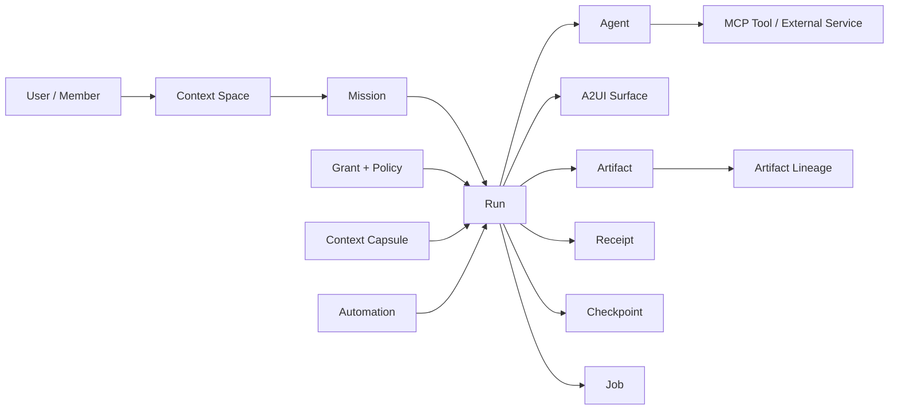
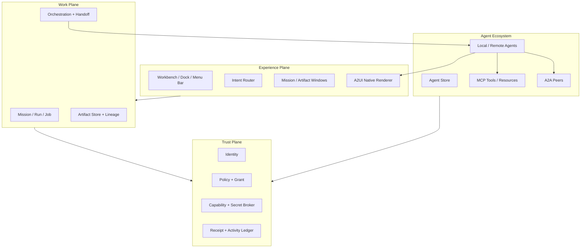

# AIOS 产品愿景与领域模型

> 文档状态：基线方案
> 产品定位：面向桌面的 Agentic Operating Environment
> 核心命题：以可安装 Agent 扩展能力，以可信系统服务约束执行，以 A2UI 承载动态原生界面，以 Artifact 沉淀长期价值。

## 1. 产品定义

AIOS 是运行在现有桌面操作系统之上的 **Agentic Operating Environment（智能体操作环境）**。它保留用户熟悉的桌面、窗口、Dock、菜单栏与 Space 等空间交互，但将传统操作系统的能力扩展单元从 Application 改写为 Agent：

- 传统 Application 通过安装可执行代码扩展能力，并通过平台 UI API 自己构建界面。
- AIOS Agent 通过提示词、SKILL、MCP、A2A、模型策略和声明式元数据扩展能力，并通过 A2UI 请求宿主渲染可信原生界面。
- 用户不再以“打开哪个软件”为首要问题，而是先确定“要完成什么目标、基于哪些对象、允许做到什么程度、结果保存在哪里”。

AIOS 的北极星不是“让所有软件都变成聊天机器人”，而是让用户能够：

1. 从明确对象或目标发起工作；
2. 在执行前看见计划、Agent、工具、权限、预算与输出；
3. 在执行中观察并干预并行 Run；
4. 在执行后获得可编辑、可追溯、可复用的 Artifact；
5. 在任何时刻知道是谁、代表谁、基于什么上下文做了什么。

## 2. 为什么不是“macOS + 聊天框”

聊天是串行媒介，桌面是并行和空间媒介。若把所有能力塞进一个全局聊天框，AIOS 会失去桌面系统最重要的价值：稳定对象、空间记忆、并行可见性、明确授权和可恢复状态。

因此，AIOS 遵循以下不可妥协的产品原则：

- **对象先于对话**：优先从选中文件、Artifact、网页片段、邮件或 Space 发起任务。
- **计划先于执行**：有副作用、跨边界或成本较高的工作必须先产生可审阅计划。
- **产物先于消息**：对话用于澄清和协商，交付默认落为 Artifact，而不是埋在消息历史中。
- **授权先于自动化**：A2UI Action 只表达用户意图，不直接构成系统权限。
- **并行状态必须可见**：多 Agent 和后台 Run 必须出现在 Mission Control 与 Activity 中。
- **确定性控制包围概率性执行**：身份、权限、存储、调度、审计和系统界面由确定性服务控制；Agent 可以建议，不能自行扩权。

## 3. 产品边界

### 3.1 AIOS 负责什么

AIOS 在宿主操作系统之上提供一套完整的用户与 Agent 控制平面：

- macOS 启发的桌面 Shell：Workbench、Dock、Menu Bar、Window、Space 与 Mission Control；
- Agent 安装、签名验证、版本兼容、能力声明、更新和卸载；
- Agent 路由、Mission 编排、Run/Job 调度、后台 Automation 与失败恢复；
- A2UI Catalog、消息校验、原生渲染、动作拦截和无障碍语义；
- Context Space、Context Capsule、Artifact、版本和 Lineage；
- 身份、Grant、Policy、Secret Broker、Trusted Approval 与 Activity Ledger；
- MCP 工具接入、A2A Agent 协作以及对这些协议的宿主级安全约束；
- 费用、模型、计算资源、网络和注意力预算的可见控制。

### 3.2 AIOS 不负责什么

AIOS 首个产品形态不自研内核，也不替代宿主系统的硬件与安全基础设施：

- 不实现新的 Kernel、Driver、文件系统驱动、登录管理器或硬件抽象层；
- 不绕过宿主系统的进程隔离、代码签名、密钥存储和设备权限；
- 不把不受约束的模型输出当作系统调用；
- 不允许 Agent 通过 A2UI 绘制系统权限、支付、安装、密钥或高风险确认界面；
- 不承诺概率性 Agent 能替代所有专业 Application；复杂创作工具可继续作为 Artifact 编辑器、MCP App 或外部工具存在；
- 不把 A2UI、A2A 或 MCP 中任何一个协议误当成完整的运行时、安全边界或产品架构。

换言之，AIOS 是一个 **Agent-aware desktop shell + trust plane + work graph**，不是一个从 Bootloader 开始重造的操作系统。

## 4. 核心领域模型

### 4.1 领域术语

| 术语 | 定义 | 必须保持的边界 |
|---|---|---|
| **Agent** | 可被安装、识别和调用的能力主体，包含能力声明、提示词、SKILL、连接器和 UI 能力。 | Agent 不是运行进程，也不是聊天人格。 |
| **Agent Package** | Agent 的签名分发单元，包含 Manifest、图标、版本、能力、协议兼容、权限上限、网络域和更新信息。 | Package 不包含用户凭证；安装不等于授权业务数据。 |
| **Agent Profile** | 安装后在本机形成的 Agent 配置，包括启用状态、Space 范围、连接、模型和记忆策略。 | Profile 可变；签名 Package 内容不可被静默篡改。 |
| **Context Space** | 按项目、角色或团队隔离上下文的长期边界，包含成员、Agent、Artifact、数据源、Policy 和预算。 | Space 不是纯视觉虚拟桌面；跨 Space 必须显式交接。 |
| **Workbench** | 当前 Space 的主要桌面，呈现置顶 Mission、Artifact、Attention 与最近活动。 | Workbench 不等于文件倾倒区。 |
| **Mission** | 围绕一个用户目标形成的持久工作容器，记录计划、Run、审批、产物与决策。 | Mission 可以跨多次会话和多个 Agent；不等于一段 Chat。 |
| **Run** | Mission 中一次可调度、可暂停、可重试的执行实例。 | Run 生命周期独立于 Window 和 Surface。 |
| **Window** | 用户查看和操纵 Mission、Artifact 或系统对象的宿主视图。 | 关闭 Window 不停止 Run。 |
| **A2UI Surface** | 由 Agent 声明、AIOS 校验并用可信组件渲染的临时交互界面。 | Surface 不是 Window、Artifact、权限边界或 Agent Runtime。 |
| **Artifact** | 可持久保存、编辑、引用、分享和追溯的结果对象，例如文档、表格、图表、数据集或自动化定义。 | Artifact 是结果事实源；Surface 只是其可能的视图。 |
| **Artifact Lineage** | Artifact 的输入、版本、派生、Agent、Run、工具和审批关系图。 | Lineage 记录来源，不暴露模型隐藏思维链。 |
| **Context Capsule** | 为某个 Run 或交接构造的最小、可检查、可过期上下文快照或引用集合。 | Capsule 不默认等于整个 Space、剪贴板历史或聊天历史。 |
| **Handoff Contract** | Agent、用户或 Space 之间的结构化交接，声明输入、输出、权限、预算、期限和失败语义。 | 交接只能收窄权限，不能隐式放大。 |
| **Grant** | 用户或 Policy 为特定主体、资源、动作、期限和目的签发的授权。 | UI Action 不自动生成 Grant；高风险动作需要独立 Trusted Approval。 |
| **Policy** | 系统、组织、用户、Space、Mission 与 Agent 范围内的规则集合。 | 有效权限取所有适用边界的交集，而不是最宽并集。 |
| **Receipt** | 对关键执行和外部副作用的可审计凭证，记录主体、参数摘要、时间、结果与可撤销句柄。 | Receipt 证明发生了什么，不等同于自然语言总结。 |
| **Checkpoint** | 可恢复的 Mission/Run 状态，包括计划、版本、Artifact 引用、A2UI 数据模型和待决审批。 | Checkpoint 可恢复内部状态，但不能假装撤销已发送邮件或已完成支付。 |
| **Job** | Run 内具有明确输入、输出、依赖、预算和状态的执行单元，可在前台或后台执行。 | Job 不是任意线程，也不拥有独立于 Run 的无限生命周期。 |
| **Automation** | 由时间、事件或规则触发的持久自动化定义；每次触发创建新的 Run 和 Job。 | Automation 由系统调度器管理；Agent 不能自行常驻并逃逸预算。 |
| **Attention Request** | 需要用户审批、补充信息、处理失败或查看完成结果的结构化请求。 | Agent 不能自行声明最高优先级或抢占前台。 |

### 4.2 领域不变量

以下规则必须由产品、协议和实现共同保证：

1. `Agent ≠ Run`：一个 Agent 可参与多个 Run，一个 Run 也可调用多个 Agent。
2. `Window ≠ Run`：Window 可关闭、隐藏和重开；Run 可继续、暂停、失败或完成。
3. `Surface ≠ Window`：Surface 由宿主决定挂载位置，Agent 无权创建任意系统级窗口。
4. `Surface ≠ Artifact`：删除或重建 Surface 不应丢失已经提交的 Artifact。
5. `Chat ≠ Mission`：Chat 只是 Mission 的协商视图之一。
6. `Action ≠ Authority`：按钮事件必须经过 Policy 与 Capability Broker 才能产生副作用。
7. `Install ≠ Grant`：安装 Agent 不授予全盘文件、账号、网络或第三方服务访问权。
8. `Retry ≠ Duplicate`：副作用操作必须使用幂等键、结果查询或补偿机制避免重复执行。

## 5. 传统操作系统与 AIOS 的完整对应

| 传统桌面操作系统 | AIOS 对应 | AI-native 差异 |
|---|---|---|
| Operating System Distribution | AIOS Environment | 运行于宿主 OS 之上，提供 Agent Shell 与 Trust Plane，不替代 Kernel。 |
| Application | Agent | 从固定功能程序转为目标导向能力主体。 |
| Application Bundle / Package | Agent Package | 额外声明提示词、SKILL、MCP/A2A、A2UI Catalog、数据用途与权限上限。 |
| Application Process | Agent Run | 可暂停、检查点、换 Agent 重放，并受预算与委托深度限制。 |
| App Window | Mission / Artifact Window | Window 是视图；运行状态归 Run，动态内容由 Surface 挂载。 |
| UI Framework API | A2UI Profile + Native Renderer | Agent 发送声明式 UI；AIOS 选择可信组件和最终视觉实现。 |
| Document | Artifact | 除内容外还包含类型、版本、来源、敏感级、Lineage 与输出契约。 |
| Desktop | Workbench | 显示当前目标、产物、待决事项和状态，而非仅陈列图标。 |
| Virtual Desktop / Spaces | Context Spaces | 同时隔离数据、记忆、成员、Agent、Policy、连接和预算。 |
| Mission Control | AIOS Mission Control | 总览 Space、Mission、Run、Job、阻塞审批和后台 Automation，而非仅窗口缩略图。 |
| Dock | Capability Dock | 固定常用 Agent 与系统能力，并区分可用、运行、阻塞和待审批状态。 |
| Menu Bar | Global State Bar | 显示当前 Space、Attention、Activity、同步、隐私、模型和计算状态。 |
| Spotlight | Intent Router | 同时支持 Find、Go、Ask、Create、Act 与 Automate，并生成可审阅计划。 |
| Notification Center | Attention Center | 将消息分为审批、需输入、失败/部分完成、完成/信息，并批量去重。 |
| Finder / File Explorer | Artifact Library + File Compatibility | 保留目录互操作，同时提供语义检索、Lineage、引用与版本视图。 |
| System Settings | Preferences + Policies | 除外观偏好外，还管理 Agent、Grant、Connection、Memory、Model、Automation 和 Activity。 |
| Clipboard | Context Shelf / Semantic Clipboard | 携带来源、格式、敏感标签、快照/引用语义、过期时间与可见授权范围。 |
| Share Sheet | Handoff Sheet | 分享的不只是文件，还包括最小上下文、目标主体、权限、期限与输出合同。 |
| Open With | Act with… | 根据对象、能力、信任、成本和本地性选择 Agent。 |
| Default Application | Routing Policy | 为特定意图、对象类型和 Space 固定默认 Agent 或编排模板。 |
| App Store | Agent Store | 审核身份、供应链、权限、数据路径、工具端点、协议兼容和可验证能力。 |
| Applications Folder / Launchpad | Agent Library | 管理已安装 Agent、启用状态、版本、连接、权限、记忆和历史 Run。 |
| App Sandbox / TCC | Capability Broker + Grant | 以资源、动作、目的、期限、预算和委托链为粒度实施最小权限。 |
| IPC / XPC | A2A + Typed Handoff | Agent 间通过任务与 Artifact 合同协作，而非共享隐式全局上下文。 |
| Plug-in / Extension | SKILL / MCP Server / Catalog Extension | 分别扩展认知流程、工具数据能力和可渲染组件；三者权限边界不同。 |
| Login Items / Daemon | Automation + Scheduled Run | 显式声明触发器、预算、数据范围、输出位置、下一次运行与停止方式。 |
| Activity Monitor | Activity / Runs & Compute Monitor | 同时展示 Token、费用、工具、网络、权限、委托关系与副作用凭证。 |
| Keychain | Connection & Secret Broker | 凭证留在可信 Broker，Agent 只获得短期不透明句柄。 |
| Time Machine / Version History | Checkpoint + Replay + Lineage | 可从内部检查点重放并更换 Agent，但明确区分可恢复与不可逆外部效果。 |
| Trash | Archive / Recovery | 删除 Artifact 与停止 Run 分开，提供保留策略、恢复和 Lineage 影响提示。 |
| User Account | User Principal | 是所有授权与责任的根主体。 |
| Multi-user / File Sharing | Shared Space + Delegated Authority | 显示“谁通过哪个 Agent 代表谁行动”，支持角色与多人审批。 |
| Accessibility API | Semantic Access Layer | A2UI Catalog 组件必须提供可验证语义，并可渲染为视觉、键盘、读屏和语音界面。 |

## 6. 分层产品架构

### 6.1 Experience Plane

负责所有用户可见状态、空间组织和直接操纵。Agent 不能拥有系统 Chrome、全局 Z-order、系统通知优先级或 Trusted Approval 的视觉控制权。

### 6.2 Work Plane

将自然语言目标转化为 Mission、Plan、Run、Handoff 与 Artifact。它维护持久状态，不依赖某个窗口或聊天线程存活。

### 6.3 Trust Plane

对所有特权动作进行身份绑定、范围裁决、凭证代理、审计和撤销。有效权限遵循：

`Effective Authority = User Role ∩ Space Policy ∩ Mission Grant ∩ Agent Ceiling ∩ Tool Policy`

### 6.4 Agent Ecosystem

Agent Store 负责发现与分发；Agent 负责推理与执行；MCP 负责工具、资源与提示能力；A2A 负责独立 Agent 之间的任务协作；A2UI 负责 Agent 到用户界面的声明。它们互补，但任何单一协议都不构成 AIOS。

## 7. Agent Package 与 Agent Store

### 7.1 Agent Package 最小契约

每个可安装 Agent Package 必须包含：

- 稳定 ID、名称、版本、发布者、签名、更新通道与撤销信息；
- 自定义图标及安全留白；系统信任徽章由 AIOS 叠加，Package 不可自定义；
- 能力与 Artifact 输入/输出类型声明；
- 提示词、SKILL、模型需求和可选本地/远程执行方式；
- MCP Server、A2A Endpoint、允许访问的网络域和数据用途；
- A2UI 协议版本、Catalog ID、Catalog 摘要和降级策略；
- 权限上限、可声明的 Automation 触发器、最大委托深度和预算类别；
- Memory Schema、保留策略和跨 Space 行为；
- 兼容性、健康检查、能力测试和供应链证明。

Package 只能声明其可能需要的最大能力，不能在安装时自动获得这些能力。

### 7.2 Agent Store 不是提示词货架

Agent Store 的详情页必须让用户在安装前回答五个问题：

1. 它由谁发布，身份和版本是否可信？
2. 它真正能完成哪些可验证任务，而不是写了哪些营销文案？
3. 它会调用哪些模型、服务器、工具和外部域？
4. 数据会流向哪里、保留多久、由谁处理？
5. 它可能请求哪些权限、产生哪些费用和不可逆副作用？

“已验证发布者”只证明身份，不等于 Agent 无风险；“已收录 MCP Registry”也不等于安全审核通过。

## 8. A2UI 产品边界

A2UI 是 AIOS 的 **Agent UI 输入协议**，不是操作系统 UI ABI、任意代码容器或安全沙箱。AIOS 应维护稳定的 `AIOS UI Profile`：

`AIOS UI Profile = A2UI 版本 + 签名 Catalog + 组件行为语义 + 安全策略 + 资源限额 + 无障碍规范 + 恢复规则 + 兼容测试`

必须遵循：

- Agent 只能请求已协商、已安装、已签名的 Catalog 组件；商店 Agent 默认禁止 Inline Catalog。
- 所有消息在 Agent 侧和 Client 侧都进行 Schema 校验；未知组件和运行时错误安全降级。
- A2UI 的 `action` 只生成类型化意图；网络、文件、账号、支付和外部写入仍由 Capability Broker 裁决。
- System Chrome、Trusted Approval、安装、支付、密钥和删除确认不属于 Agent Surface。
- A2UI Surface 具备明确 owner：`agentId + runId + surfaceId`；多 Agent 之间禁止错误路由事件或数据模型。
- `sendDataModel` 默认关闭；优先使用字段级 Action Context，敏感字段不进入普通模型上下文。
- Surface 更新受组件数、树深、频率、资源大小、远程 URL、CPU、内存与动画预算限制。
- AIOS 固定自己的兼容层，通过版本适配器支持 A2UI 演进，避免把 Candidate 特性变成不可逆产品依赖。

截至本基线制定时，A2UI 官方将 `v0.9.1` 标记为当前生产版本，将 `v1.0` 标记为 Candidate；实现必须进行能力协商和版本分支，而不是假设协议已冻结。

## 9. MVP 产品闭环

UI 不是 MVP 的包装层，而是验证 AIOS 是否成立的核心。MVP 必须形成以下完整闭环：

1. 在 Agent Store 查看并安装签名 Agent，安装后保持未授权状态；
2. 在 Context Space 的 Workbench 选择对象或通过 Intent Router 描述目标；
3. 生成包含输入、步骤、Agent、工具、输出、权限、预算和风险的 Plan Card；
4. 通过系统 Trusted Approval 签发最小、短期 Mission Grant；
5. 启动 Run，在 Mission Window 中以 A2UI Surface 呈现交互并可转入后台；
6. 在 Mission Control 与 Activity 中查看单 Agent或多 Agent 的状态、阻塞与成本；
7. 将结果提交为 Artifact，在 Lineage 中查看来源、版本、Run 和 Receipt；
8. 模拟至少一种失败，从 Checkpoint 重试、换 Agent 或接受部分结果；
9. 关闭并重开 Window 后恢复 Mission，而 Run 与 Artifact 状态保持正确。

### 9.1 MVP 必须具备

- Workbench、Dock、Menu Bar、Intent Router、Mission Window 与 Mission Control；
- Agent Store、Agent Library 与安装后的零权限状态；
- Context Space、Context Shelf、Artifact Library 与基础 Lineage；
- A2UI 基础 Catalog、双侧校验、稳定增量渲染和文本降级；
- Mission、Run、Grant、Trusted Approval、Receipt、Activity 与 Checkpoint；
- 前台/后台切换、暂停、停止、重试、取消和部分完成；
- 至少两 Agent 的显式 Handoff 与独立 Surface ownership；
- 键盘操作、读屏语义、减弱动态、高对比和中英文内容适配。

### 9.2 MVP 明确不做

- 自研 Kernel、Driver、登录桌面和硬件管理；
- 允许未审核第三方代码成为系统级 A2UI 组件；
- 自动授予全盘访问或默认开放所有 MCP Tool；
- 以自然语言对话历史作为唯一状态存储；
- 对支付、发信、发布和删除等外部副作用承诺通用回滚；
- 追求与 macOS 的像素级复制或使用受保护的系统商标与图标。

## 10. 成功标准

MVP 被认为成立，至少满足：

- 新用户能够在不理解 A2UI、MCP 或 A2A 的前提下完成一次“安装 → 授权 → 执行 → 产物 → 恢复”闭环；
- 100% 高风险动作由系统 Trusted Approval 渲染，Agent Surface 无直接完成路径；
- 100% Run 可在 Window 关闭后从 Activity 找回，并准确显示是否仍在运行；
- 100% Artifact 可回溯至创建 Run、Agent 版本、输入来源和关键 Receipt；
- A2UI 消息非法、组件缺失或网络中断时，Shell 不崩溃且用户获得明确恢复路径；
- 键盘用户能够完成安装、调用、审批、运行观察、结果保存和失败恢复全流程；
- 多 Agent Mission 中，每个 Handoff 都能解释输入、输出、权限、预算和责任主体；
- 用户可在授权前缩小资源范围，并可在 Activity 中撤销后续访问。

## 11. 主要风险与产品对策

| 风险 | 失败表现 | 产品对策 |
|---|---|---|
| 退化为聊天壳 | 所有对象、进度和结果埋在消息流 | 强制 Mission、Run、Artifact 一等化；Chat 仅作为协商侧栏。 |
| Agent 冒充系统 | 伪造授权或支付界面诱导确认 | System Chrome 保留视觉与层级；A2UI 禁用保留组件和系统命名空间。 |
| 授权疲劳 | 用户习惯性点击“始终允许” | 安装零权限、按任务授权、可收窄范围、风险分级与可读 Receipt。 |
| 动态 UI 不稳定 | 按钮位移、焦点丢失、输入被覆盖 | Stable Regions、差异更新、编辑锁、焦点保持和动作提交前冻结。 |
| 多 Agent 失控 | 成本循环、隐式子 Agent、责任不清 | 显式 DAG、深度/时间/费用预算、Handoff Contract 与主体链。 |
| 上下文泄漏 | 整个 Space、剪贴板或个人记忆被发送 | Context Capsule、字段级上下文、敏感标签和跨 Space 交接预览。 |
| 假完成 | Agent 宣称成功但外部系统未生效 | Output Contract、结果查询、Receipt 和部分完成状态。 |
| 假回滚 | 重试导致重复付款或已发邮件无法撤回 | 幂等键、Checkpoint、补偿动作与明确不可逆提示。 |
| Store 低质化 | 大量同质 Prompt Wrapper 淹没有效 Agent | 能力测试、来源证明、版本质量、权限透明和任务成功率评价。 |
| 协议漂移 | A2UI 或工具更新使界面失效 | AIOS UI Profile、版本锁定、能力协商、适配器与安全降级。 |

## 12. 决策摘要

- 采用 **宿主 OS 上的 Agentic Operating Environment**，不自研内核。
- 采用 **Mission/Run/Surface/Artifact** 分离的领域模型，Window 不拥有执行生命周期。
- 保留 macOS 的空间与操作肌肉记忆，但不进行像素、图标或品牌克隆。
- 采用 **A2UI 作为声明式 UI 输入协议**，系统拥有 Renderer、Catalog、Chrome 与权限裁决。
- 采用 **Agent Store + Agent Package** 作为能力分发机制，安装与授权彻底分离。
- 采用 **Artifact + Lineage + Receipt + Checkpoint** 作为持久化与恢复基础，而不是保存聊天记录了事。
- 采用 **Context Space + Capsule + Handoff Contract** 管理单人、多用户和多 Agent 的上下文边界。

## 参考依据

- [A2UI 官方站点](https://a2ui.org/)
- [A2UI Core Concepts](https://a2ui.org/concepts/overview/)
- [A2UI Actions](https://a2ui.org/concepts/actions/)
- [A2UI Catalogs](https://a2ui.org/catalogs/)
- [Google Developers Blog：Introducing A2UI](https://developers.googleblog.com/introducing-a2ui-an-open-project-for-agent-driven-interfaces/)
