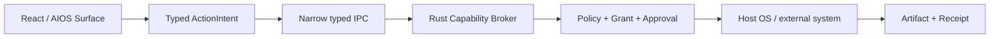

# AIOS 开源方案评估与采用基线

> 调研快照：2026-07-25。本文记录当前演示真正使用的依赖、未采用方案及进入生产阶段的约束。版本以仓库 `package.json` 与 `pnpm-lock.yaml` 为准；星标、下载量等热度只用于风险判断，不作为质量证明。

## 1. 结论

AIOS 演示采用 **React 19 + Vite + TypeScript** 构建可立即访问的 Web 桌面；用 **LiqUIdify** 提供现成的 macOS/HIG 风格组件基础；用 Google 发起的官方 **A2UI React renderer 与 web core** 渲染 Agent 声明式界面；用 **React Flow** 展示 Mission DAG；用 **Zustand** 管理可恢复的演示状态。

关键边界如下：

- LiqUIdify 满足“macOS UI 采用开源方案”的要求，但成熟度低，只能通过 `src/ui-system` 反腐层进入业务代码，并精确锁定版本；
- A2UI 是 Agent 的**界面表达协议**，不是 AIOS 的权限或系统调用 ABI；任何真实副作用仍必须转为 `ActionIntent` 并经过 Capability Broker 与 Trusted Approval；
- 当前目标是最快完成高保真交互验证，因此先交付浏览器演示；生产桌面宿主后续采用 **Tauri 2**，但不会让 Web renderer 直接获得宿主能力；
- `tauri-controls` 当前不采用：它依赖 Tauri 运行时，且 `0.4.0` 的 React peer 仅支持 React 18，与本项目 React 19 基线冲突。

## 2. 评估原则

候选项目按以下维度评估，而不是按截图或星标单点决策：

1. **架构适配**：是否强化 Agent/UI/权限三者分离，而不是绕过 Trust Kernel；
2. **交付速度**：能否在演示期复用成熟交互、组件和测试资产；
3. **协议与生态**：是否使用公开协议、稳定 API、类型声明和可替换接口；
4. **维护风险**：维护活跃度、语义化版本、破坏性变更、社区规模与 bus factor；
5. **安全边界**：是否会引入任意代码执行、ambient authority、伪造系统 UI 或供应链盲区；
6. **许可证**：必须允许当前演示及后续商业化，并保留许可证归属；
7. **可替换性**：高风险依赖必须位于适配层之后，业务领域模型不能依赖其私有类型。

## 3. 已采用方案

| 层 | 采用项目与精确版本 | 许可证 | 用途 | 决策与约束 |
|---|---|---|---|---|
| UI runtime | React `19.2.8`、React DOM `19.2.8` | MIT | 组件渲染与交互 | A2UI React 包要求 React 19；业务状态与协议模型保持框架无关。 |
| 开发/构建 | Vite `8.1.5`、TypeScript `7.0.2` | MIT / Apache-2.0 | 快速开发服务器、类型检查与生产 bundle | 用于 Web-first 演示；不承担桌面权限。 |
| macOS 风格组件 | `liquidify-react` `0.6.25` | MIT | Button、Badge、Card、SymbolTile 等 HIG 风格基础组件 | **有条件采用**；所有引用经 `src/ui-system`，精确锁版，禁止业务层直接耦合；系统级可信确认仍由 AIOS 自己组合并保留样式命名空间。 |
| Agent UI | `@a2ui/react` `0.10.2`、`@a2ui/web_core` `0.10.5` | Apache-2.0 | 处理并渲染 A2UI 消息批次 | 当前显式使用协议 **v0.9.1** 的 renderer 入口；包版本与协议版本是两套版本线。只接受受信 Catalog 和 schema 验证后的声明式内容。 |
| Mission DAG | `@xyflow/react` `12.11.2` | MIT | Job 节点、依赖边、缩放与浏览控制 | 成熟度和交互能力高；只负责可视化，不成为 Mission 状态源。 |
| 状态 | Zustand `5.0.14` | MIT | 安装、Mission、Approval、Artifact、Receipt 与 Activity 的单一演示状态源 | 领域状态通过显式 action 改变；只持久化可恢复的稳定 checkpoint。 |
| 动效与组件支撑 | Framer Motion `12.42.2`、Ark UI React `5.37.2`、Lucide React `0.552.0` | MIT | 动效、LiqUIdify peer、统一矢量图标 | 尊重 `prefers-reduced-motion`；图标不承担唯一的状态表达。 |
| 数据校验 | Zod `3.25.76` | MIT | A2UI 官方 React 包 peer 与结构化数据校验 | 不把 TypeScript 类型当作运行时信任边界。 |

### 3.1 LiqUIdify：接受低成熟度风险，但封装后使用

[LiqUIdify](https://github.com/tuliopc23/LiqUIdify) 提供 HIG/macOS 风格 React 组件，MIT 许可，和本项目 React 19、Ark UI、Framer Motion、Lucide 技术栈兼容，能显著缩短桌面壳、卡片、徽章和按钮的视觉落地时间。因此它是当前 macOS 风格基础的正式采用项，而不是仅作设计参考。

风险同样明确：调研时仓库约 **9 stars**、`0 forks`，npm 仍是 `0.6.x`，API 尚未进入 1.0 稳定期；包 README 与实际发布版本的表述也不能作为兼容性保证。这意味着它属于“高交付收益、高维护风险”依赖。

强制缓解措施：

- 业务代码只从 `src/ui-system` 导入基础 UI，不直接从 `liquidify-react` 导入；
- 精确固定 `0.6.25`，升级必须经过视觉回归、类型检查、构建和关键旅程测试；
- `AgentIcon`、`MacWindowChrome`、Trusted Approval 和 AIOS token 由适配层或系统层持有，避免把系统身份交给第三方主题；
- 禁止使用 Apple 商标、专有 SF Symbols、系统壁纸和逐像素拷贝；目标是熟悉的空间与材质语言，而非冒充 macOS；
- 若项目停止维护，只替换 `src/ui-system` 的实现，Store、Workbench、Artifact 等领域组件接口保持不变。

### 3.2 A2UI：使用官方 renderer，但不授予 authority

[A2UI 官方站点](https://a2ui.org/) 将其定义为 Agent 发送声明式 UI、由客户端使用自身组件库渲染的开放协议，并标明 Apache 2.0 许可；当前规范线为 [v0.9.1](https://a2ui.org/specification/v0.9-a2ui/)。仓库采用：

- [`@a2ui/react@0.10.2`](https://www.npmjs.com/package/@a2ui/react)：React renderer 和受信组件 Catalog；
- [`@a2ui/web_core@0.10.5`](https://www.npmjs.com/package/@a2ui/web_core)：消息处理、Surface model 与数据模型同步；
- `@a2ui/react/v0_9` 入口：将实现固定到 AIOS UI Profile 声明的 A2UI `v0.9.1` 协议边界。

采用官方包避免自写协议 parser 和 renderer，但不能把外部消息视作可信代码。演示中的 Agent Surface 只可：

1. 创建或更新声明式 Surface；
2. 使用 AIOS 允许的 Catalog 组件；
3. 发出受限 UI action，转换为无副作用的 `ActionIntent`；
4. 在未知消息或 Catalog 不匹配时安全失败。

它不可直接创建日历事件、访问文件、读取 Secret、伪造 Trusted Approval 或覆盖 System Chrome。当前宿主已对协议版本、单消息操作、Catalog、组件 schema、批量消息数、序列化字节数和组件数执行 fail-closed 校验；生产阶段还必须补齐嵌套深度、持续速率、资源与 streaming 限制，并在 Rust 信任边界重复验证。

### 3.3 React Flow：复用成熟图编辑器，而非自写画布

[React Flow 12.11.2](https://reactflow.dev/) 提供节点/边、缩放、平移、键盘交互、定制节点与性能优化，MIT 许可且具有大规模社区采用。AIOS 用它展示 Mission 的 Job/Delegation DAG；`Mission.jobs` 仍是事实来源，React Flow nodes/edges 只是确定性投影。这样可避免把画布组件的内部状态升级成领域状态。

### 3.4 React、Vite 与 Zustand：演示速度和边界清晰优先

- [React](https://react.dev/) 适配 A2UI 官方 renderer 和所选 UI 组件生态；
- [Vite](https://vite.dev/) 提供快速 HMR 与可直接部署的静态演示包；
- [Zustand](https://github.com/pmndrs/zustand) 足以实现当前有限状态机和选择性持久化，避免为演示引入重量级事件平台。

Zustand 不是未来 Trust Kernel 的审计账本。生产阶段的 Receipt、Grant、审批 nonce、effect key 和外部副作用状态必须在受信后端持久化，并以事务和不可篡改序列保护。

## 4. 未采用与延期方案

### 4.1 `tauri-controls` / `@tauri-controls/react` `0.4.0`：当前排除

该项目是 MIT 许可的 Tauri 窗口控件库，定位本身合理，但不适合当前交付基线：

- npm peer dependencies 明确是 `react`/`react-dom ^18.2.0`，与本项目 React `19.2.8` 不兼容；强制忽略 peer 会把依赖冲突转化为运行时风险；
- 控件依赖 Tauri API 和相关插件，而当前演示需要直接在浏览器中快速打开和验收；
- 它只提供仿原生的 HTML 窗口控件，不等于原生安全边界，也不能承担 AIOS Trusted Approval。

因此当前不安装、不打补丁、不使用 `--force` 绕过 peer。进入 Tauri 2 阶段时再按届时版本、React 19 支持、平台一致性和安全审计重新评估；即使采用，也只处理窗口装饰。

### 4.2 Tauri 2：生产桌面宿主，当前延期

[Tauri 2](https://v2.tauri.app/) 适合作为未来 Windows/macOS/Linux 桌面宿主：Web UI 可复用，Rust 侧可承载本地 Broker、持久化、系统集成和签名更新，capabilities 配置也有利于最小权限设计。

本轮不立即封装 Tauri，原因是浏览器演示更快验证关键产品闭环，且当前没有真实文件、日历、Secret 或网络副作用需要桥接。延期不代表放弃，进入生产 MVP 时边界必须是：

WebView 不获得任意 shell、filesystem、network 或 secret API。所有命令都以能力为单位显式声明、参数校验并输出 Receipt。

## 5. 供应链与升级策略

### 5.1 当前演示门槛

- 生产依赖使用精确版本，提交 `pnpm-lock.yaml`；
- `pnpm install --frozen-lockfile` 必须可复现；
- 每次依赖变更必须通过 peer dependency、许可证、typecheck、unit test、build 和浏览器关键旅程；
- UI/A2UI 包升级必须增加截图对比和恶意/未知 payload 的安全失败测试；
- 保留所有 MIT、Apache-2.0 依赖的 LICENSE 与 NOTICE 义务；发布前生成第三方依赖清单。

### 5.2 进入开放 Agent Store 前

还必须具备 Agent Package 全包 digest/签名、SBOM/Agent BOM、发布者验证、透明日志、可回滚更新、Catalog 审核、A2UI fuzz、MCP/A2A destination 固定与紧急吊销。当前 Store 只演示第一方固定清单和确定性安装流程，不应被宣传为已安全开放第三方上架。

## 6. 决策记录

| 决策 | 状态 | 重新评估触发器 |
|---|---|---|
| Web-first React/Vite 演示 | Adopted | 需要真实宿主能力或发行桌面安装包。 |
| LiqUIdify 经 `ui-system` 反腐层提供 macOS 风格 | Adopted with risk | 破坏性升级、停止维护、安全问题或无法满足可访问性。 |
| 官方 A2UI React/web_core，协议固定 v0.9.1 | Adopted | A2UI v1.0 稳定、协议兼容性或安全模型改变。 |
| React Flow 展示 Mission DAG | Adopted | DAG 规模或布局需求超出客户端方案。 |
| Zustand 管演示状态 | Adopted for demo | 进入多用户、跨设备、事务性 Receipt 与真实恢复。 |
| `tauri-controls 0.4.0` | Rejected for current demo | 发布 React 19 兼容版且进入 Tauri 桌面阶段。 |
| Tauri 2 桌面宿主 | Deferred, preferred | 进入生产桌面 MVP。 |

## 7. 证据来源

- [LiqUIdify GitHub 与 MIT License](https://github.com/tuliopc23/LiqUIdify)
- [A2UI 官方站点与规范](https://a2ui.org/)
- [`@a2ui/react` npm 元数据](https://www.npmjs.com/package/@a2ui/react)
- [`@a2ui/web_core` npm 元数据](https://www.npmjs.com/package/@a2ui/web_core)
- [React Flow 官方站点、版本与 MIT License](https://reactflow.dev/)
- [Zustand GitHub](https://github.com/pmndrs/zustand)
- [Vite 官方文档](https://vite.dev/)
- [Tauri 2 官方文档](https://v2.tauri.app/)
- [`@tauri-controls/react` npm 元数据](https://www.npmjs.com/package/@tauri-controls/react)
