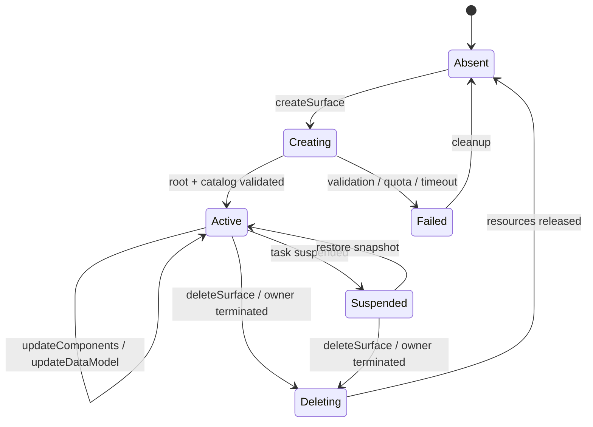
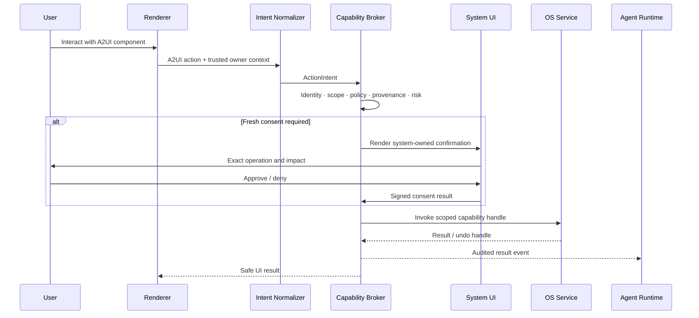

# AIOS UI Profile 规范

> 状态：MVP 冻结候选（Normative Draft）
> 基准日期：2026-07-25
> Profile 版本：`aios.ui/1.0`
> 外部协议基线：A2UI `v0.9.1`
> 外部协议候选：A2UI `v1.0`，仅允许经版本适配器接入

## 1. 结论与范围

AIOS 将 A2UI 定位为 **Agent 到 Renderer 的声明式 UI Wire Protocol / UI IR 输入格式**，而不是操作系统权限接口，也不是不可变的内核 ABI。

AIOS 对 Agent 稳定承诺的界面契约是 `AIOS UI Profile`：

```text
AIOS UI Profile
= A2UI 协议版本与适配规则
+ 签名且版本化的 Catalog
+ Surface IR 与组件行为语义
+ 身份、来源和系统 UI 隔离规则
+ 消息一致性与恢复规则
+ 数据最小化与资源限额
+ 无障碍与国际化要求
+ ActionIntent → Capability Broker 契约
+ Conformance / TCK
```

本规范定义：

- Agent 可生成什么 UI，以及 UI 如何进入 AIOS Shell。
- A2UI `v0.9.1` 如何转换为稳定的内部 Surface IR。
- A2UI `v1.0` Candidate 如何通过 Adapter 隔离其不稳定性。
- Agent UI、系统 UI、MCP 内容和 A2A 远程 Agent 之间的信任边界。
- Catalog、Surface、消息、一致性、限额、无障碍和兼容性要求。
- UI Action 如何转换为不带隐含权限的 `ActionIntent`，再交由 Capability Broker 决策。

本规范不定义：

- Agent 包格式、安装、签名、更新和商店审核的完整协议。
- MCP Tool、A2A Task 或模型推理的内部实现。
- 文件、网络、设备、凭证、支付等系统能力本身；这些由 Capability ABI 定义。
- Shell 的像素级视觉稿。但所有 Renderer 必须使用 AIOS Design Tokens，保持统一的 macOS 风格设计语言。

文中的“必须”“禁止”“应当”“可以”分别对应强制要求、禁止项、推荐要求和可选能力。

## 2. 官方事实基线与 AIOS 决策

### 2.1 官方事实

截至 2026-07-25：

1. [A2UI v0.9.1](https://a2ui.org/specification/v0.9.1-a2ui/) 是官方标注的 Current Production 协议；[A2UI v1.0](https://a2ui.org/specification/v1.0-a2ui/) 仍是 Candidate。
2. v0.9.1 的 Agent → Renderer 消息包括 `createSurface`、`updateComponents`、`updateDataModel`、`deleteSurface`；Renderer → Agent 包括 `action` 和 `error`。
3. v1.0 增加 `actionResponse`、`callFunction`、`functionResponse`，允许在 `createSurface` 中携带初始组件和数据模型，并以 `surfaceProperties` 取代 v0.9.x 的 `theme`。
4. A2UI 采用扁平邻接表表示组件树，通过组件 ID 引用子组件；数据绑定使用 JSON Pointer；结构和数据模型相互分离。[组件模型](https://a2ui.org/concepts/components/)
5. A2UI 是传输无关协议。Transport 负责有序可靠交付、消息分帧、Metadata 和交互所需的反向通道。
6. Catalog 是 Agent 与 Renderer 的 JSON Schema 契约；`catalogId` 是标识符，不保证是可下载 URL。自定义 Catalog 仍要求客户端预先实现并注册对应组件。[Catalog 指南](https://a2ui.org/guides/defining-your-own-catalog/)
7. React、Lit、Angular、Flutter 对 v0.9.1 的支持被官方列为稳定；其 v1.0 支持仍为 Planned。SwiftUI 和 Jetpack Compose Renderer 也仍在计划中。[Renderer 清单](https://a2ui.org/reference/renderers/)
8. 官方路线图把 v1.0 的稳定性保证、完整测试套件和 Renderer 认证计划放在 Q4 2026；性能基准、虚拟列表、多 Agent 冲突处理和完整无障碍支持仍在演进。[A2UI Roadmap](https://a2ui.org/roadmap/)
9. A2A Binding 中，同一 `DataPart` 内的 A2UI 消息数组按顺序处理，但不是事务单元；单条失败后必须继续处理后续消息。[A2UI A2A Extension](https://a2ui.org/specification/v0.9.1-a2ui-extension-specification/)
10. `sendDataModel: true` 会通过 Transport Metadata 回传 Surface 的本地数据模型；多 Agent 数据隔离是 Orchestrator 的责任。[A2UI Actions](https://a2ui.org/concepts/actions/)
11. A2UI 的安全边界是声明式、预注册组件和 Schema 校验，而非完整沙箱。官方要求只注册可信组件、校验属性并清理不可信文本。[自定义 Catalog 安全要求](https://a2ui.org/guides/defining-your-own-catalog/)

### 2.2 AIOS 决策

1. MVP 必须 pin A2UI `v0.9.1`。
2. A2UI `v1.0` 只能由 `A2UI Version Adapter` 接入，禁止 Renderer、Shell 业务代码直接依赖 Candidate wire types。
3. AIOS 稳定 ABI 是本规范定义的 Surface IR、签名 Catalog、ActionIntent 和 TCK，而不是任一 A2UI JSON Schema 的原样镜像。
4. 未协商版本、Catalog 或安全能力的消息必须拒绝，不得“尽量猜测”后渲染。
5. Agent UI 只表达界面和用户意图。所有系统副作用必须重新进入 Capability Broker 鉴权。

## 3. A2UI、A2A、MCP 与 AIOS 的边界

| 层 | 负责 | 不负责 |
|---|---|---|
| A2UI | Surface、组件、数据绑定、增量 UI、用户 Action | Agent 安装、身份认证、权限、工具执行、系统资源、进程隔离 |
| A2A | 独立 Agent 的发现、消息、任务、流式和异步协作、认证方案声明 | Tool 调用、Agent 内部子 Agent 实现、UI 组件语义 |
| MCP | Host 与 MCP Server 间的 Tools、Resources、Prompts、Sampling 和通知 | Agent-to-Agent 协作、桌面 UI、AIOS 权限策略 |
| AIOS UI Profile | A2UI 版本适配、Catalog、Surface IR、Renderer 语义、安全与一致性 | 真实系统能力的授权和执行 |
| Capability Broker | 按 Agent、用户、会话、资源和风险重新授权并执行系统能力 | Agent 生成 UI |

依据：

- [A2A 官方说明](https://a2a-protocol.org/latest/)明确区分 A2A 的 Agent 通信与 MCP 的工具连接。
- [MCP Architecture](https://modelcontextprotocol.io/docs/learn/architecture)定义 Host–Client–Server，以及 Tools、Resources、Prompts 等核心原语。
- [A2UI over MCP](https://a2ui.org/guides/a2ui_over_mcp/)允许 MCP Resource 或 Tool Result 承载 A2UI，但不会把 MCP 变成 UI 权限系统。

AIOS 必须把每条输入绑定到真实来源：

- A2A 输入绑定到已认证的远程 Agent 身份和其 Agent Package / Store 记录。
- MCP 返回的 A2UI 绑定到发起调用的 Agent、MCP Server 身份和 Tool 调用记录，标记为 `tool-derived`。
- 本地 Agent 输入绑定到已验证的包签名、版本和运行时实例。
- Transport Metadata 只是传递载体，不是授权依据。

## 4. 总体架构

```mermaid
flowchart LR
    Package["Signed Agent Package<br/>Prompt · Skill · MCP · Icon"]
    Runtime["Agent Runtime"]
    Gateway["Local IPC / A2A / MCP Bridge"]
    Adapter["A2UI Version Adapter<br/>v0.9.1 · v1 Candidate"]
    Guard["Identity Binding<br/>Schema · Catalog · Quota · Policy"]
    IR["AIOS Surface IR"]
    Renderer["Surface Model + Native Renderer"]
    Shell["AIOS Shell / Window"]
    Intent["ActionIntent Normalizer"]
    Broker["Capability Broker"]
    System["Files · Network · Devices · Secrets"]

    Package --> Runtime --> Gateway --> Adapter --> Guard --> IR --> Renderer --> Shell
    Shell --> Intent --> Broker --> System
    Broker --> Runtime
```



强制边界：

- Adapter 之前的数据均为不可信外部输入。
- Guard 通过之前不得创建组件实例、加载远程资源或执行函数。
- Surface IR 之后不得保留由 Agent 自称的身份、权限或信任等级。
- Agent 事件必须经过 ActionIntent Normalizer 和 Capability Broker；Renderer 不得直接调用 OS API。

## 5. 版本策略与 Adapter

### 5.1 协议版本

| 输入版本 | MVP 策略 | 说明 |
|---|---|---|
| A2UI v0.8 | 默认拒绝 | 仅迁移工具可以离线转换，不进入生产 Renderer |
| A2UI v0.9 | 默认拒绝 | Agent 必须升级到 v0.9.1；开发模式可显式启用兼容转换 |
| A2UI v0.9.1 | 必须支持 | MVP 生产基线 |
| A2UI v1.0 Candidate | Adapter 后实验支持 | 默认 feature flag 关闭，不构成兼容性承诺 |
| 未知版本 | 必须拒绝 | 返回 `UNSUPPORTED_PROTOCOL_VERSION` |

### 5.2 Adapter 职责

Adapter 必须：

1. 校验 wire version，并转换为同一套内部命令。
2. 将 v0.9.1 `theme` 和 v1.0 `surfaceProperties` 转换为受限的 `presentationHints`；Agent 提供的颜色、名称和图标不得直接成为系统身份或系统视觉 Token。
3. 将 v0.9.1 `action`、v1.0 `action` / `actionResponse` 统一映射为内部 Action 关联模型。
4. 对 v1.0 `callFunction` 默认拒绝；只有 Catalog 明确声明、Renderer 本地注册且 Policy 允许的纯 UI 函数可以执行。
5. 保留原始协议版本、消息摘要和来源链，供审计与错误回传使用。
6. 对无法无损转换的字段 fail closed，禁止静默丢弃安全相关字段。

Renderer 和 Shell 业务代码禁止通过条件分支识别 A2UI 版本。版本差异只能存在于 Adapter 和对应测试夹具中。

## 6. AIOS Surface IR

Surface IR 是 Renderer 唯一接受的输入。以下为逻辑模型；实现可以使用类型安全的内部结构，而非直接序列化此示例。

```yaml
profileVersion: aios.ui/1.0
source:
  protocol: a2ui
  wireVersion: v0.9.1
  transport: local-ipc | a2a | mcp-bridge
  messageDigest: sha256:...
owner:
  agentId: dev.aios.example.calendar
  agentVersion: 1.4.2
  publisherKeyId: sha256:...
  runtimeInstanceId: uuid
session:
  taskId: uuid
  sessionEpoch: 3
surface:
  canonicalId: agentId/taskId/upstreamSurfaceId
  upstreamSurfaceId: booking-form
  revision: 12
  role: workspace | panel | inspector | popover | notification-content
catalog:
  id: https://aios.dev/catalogs/shell/1.0.0
  version: 1.0.0
  digest: sha256:...
tree:
  rootId: root
  components: ComponentMap
dataModel: JSONValue
presentationHints:
  preferredWidth: regular
  density: comfortable
provenance:
  trustTier: verified-agent | unverified-agent | tool-derived
  chain: []
```

### 6.1 可信字段来源

下列字段必须由 AIOS Runtime / Store / Gateway 注入，禁止从 A2UI payload 采信：

- `owner.agentId`
- `owner.agentVersion`
- `owner.publisherKeyId`
- `runtimeInstanceId`
- `taskId`
- `sessionEpoch`
- `trustTier`
- Catalog digest 和授权状态

Agent 可提供 `surfaceId`，但 AIOS 必须规范化为全局唯一的 `canonicalId`。这满足 A2UI 对 Renderer 生命周期内 Surface ID 唯一性的要求，同时避免不同 Agent 冲突。

### 6.2 Surface 角色

Agent 可请求但不能强制以下角色：

- `workspace`：任务主要工作区。
- `panel`：辅助面板。
- `inspector`：对象详情和属性检查。
- `popover`：由用户操作触发的轻量浮层。
- `notification-content`：通知正文，不包含系统动作权限。

Window level、焦点抢占、全屏、置顶、系统菜单栏、Dock 和系统通知优先级由 Shell 决定，不属于 Agent 权限。

## 7. Surface 生命周期与消息一致性



### 7.1 应用流水线

每条消息必须依次经过：

1. Transport 身份上下文绑定。
2. JSON 解析与协议 Schema 校验。
3. Catalog ID、版本和 digest 校验。
4. 组件属性和函数参数校验。
5. 资源限额、URL、文本和引用图校验。
6. Surface owner、session epoch 和 revision 校验。
7. 在隔离的候选状态上应用消息。
8. 候选状态完整性校验。
9. 原子提交单条消息。
10. 合并重绘并生成审计事件。

任何步骤失败均不得部分提交该消息。

### 7.2 AIOS 一致性扩展

A2UI 只保证依赖有序消息的状态模型；AIOS 在 Transport Metadata 或本地 IPC Envelope 中增加：

```yaml
aiosUi:
  profileVersion: aios.ui/1.0
  sessionEpoch: 3
  sequence: 184
  baseRevision: 11
  batchId: uuid
  batchEnd: true
  idempotencyKey: uuid
  traceId: W3C-trace-id
```

规则：

- `sequence` 必须在同一 Agent runtime stream 内严格递增；重复序号按幂等结果处理，缺口触发重同步。
- `sessionEpoch` 不匹配时拒绝旧会话消息，防止恢复后延迟消息覆盖新状态。
- `baseRevision` 不等于当前 Surface revision 时返回 `REVISION_CONFLICT`，不得自动覆盖。
- 每条消息成功提交后 revision 加一。
- `batchId` 只控制绘制合并，不改变 A2UI 消息逐条原子提交的事实。
- 需要跨消息原子性的操作必须发送完整 Surface 快照到 AIOS 扩展端点，或使用受控的 `atomicSnapshot` IPC 命令；不得假装 A2A `DataPart` 是事务。
- `idempotencyKey` 必须用于所有可能产生 Action 或恢复副作用的命令。
- Transport 断线后，Agent 先协商 `sessionEpoch` 和最新 revision，再发送增量；无法收敛时发送快照。

### 7.3 图完整性

- Surface 必须且只能有一个 `root`。
- 组件 ID 在 Surface 内唯一。
- 禁止循环引用。
- 静态父子关系必须形成从 root 可达的有向无环图。
- 流式阶段允许短暂悬空引用；必须显示无交互占位符，并在 Agent turn 结束或 2 秒超时后转为 `DANGLING_REFERENCE`。
- 不可达组件在批次结束后回收，不得无限积累。
- `updateDataModel` 必须使用合法 JSON Pointer；禁止原型污染相关键和超出根边界的路径。

## 8. Catalog 与组件信任模型

### 8.1 MVP Catalog

MVP 对 Agent 公开一个组合 Catalog：

```text
catalogId: https://aios.dev/catalogs/shell/1.0.0
version: 1.0.0
digest: sha256:<canonical-json-digest>
```

Catalog 必须：

- 由 AIOS 签名并随系统或受信更新通道分发。
- 使用 SemVer；任何破坏性组件行为变化必须升级 major 和 `catalogId`。
- 在 Agent 安装时记录所需 Catalog 范围，在运行时通过 capability negotiation 确认。
- 将 Schema、Renderer 实现版本和行为测试绑定到同一 digest。
- 禁止运行时下载或执行组件代码。
- MVP 禁止 Inline Catalog。
- 未知组件、属性、函数或枚举值必须拒绝，禁止忽略后继续渲染。

### 8.2 MVP Agent-safe 组件目录

| 类别 | 组件 | MVP 行为要求 |
|---|---|---|
| 布局 | `Row`、`Column`、`Grid`、`SplitView`、`ScrollArea`、`Spacer`、`Divider` | 自适应尺寸；Agent 不得指定绝对屏幕坐标或 Window level |
| 容器 | `Card`、`Tabs`、`Disclosure`、`Modal` | Modal 仅是 Agent Surface 内浮层，不得模拟系统确认框 |
| 内容 | `Text`、`Markdown`、`Icon`、`Image`、`Badge`、`Progress`、`EmptyState` | Markdown 必须清理；Icon 只能使用允许列表；远程媒体经 Resource Broker |
| 输入 | `Button`、`TextField`、`TextArea`、`SearchField`、`CheckBox`、`ChoicePicker`、`DateTimeInput`、`Slider` | 双向绑定仅修改 Surface 本地数据；敏感凭证不得由普通输入组件采集 |
| 数据 | `List`、`Table`、`Tree`、`KeyValue`、`CodeBlock`、`Chart` | 大数据必须虚拟化；Chart 使用结构化数据和受限图表类型，不接受脚本 |
| 产物 | `ArtifactLink`、`FilePreview`、`CitationList` | 打开、导出、分享必须产生 ActionIntent；不得直接访问文件路径 |
| Agent 任务 | `TaskStatus`、`StepList`、`IntentPreview`、`ActivityLog` | 只能展示计划与状态；`IntentPreview` 不是授权确认 |

`Video`、`AudioPlayer` 可由 Basic Catalog Adapter 映射为受限媒体预览，但不属于首批跨 Renderer 一致性承诺。

### 8.3 函数分级

| 等级 | 示例 | 策略 |
|---|---|---|
| 纯函数 | `formatString`、`formatNumber`、`required`、`and` | 可以在 Renderer 执行；必须确定性、无 I/O、有限时 |
| 纯 UI 本地动作 | 展开、切换 Tab、Surface 内滚动 | 可由 Renderer 执行；不得访问系统资源 |
| 导航意图 | 打开 URL、打开 Artifact | 必须转为 ActionIntent，由 Broker 检查 scheme、来源和用户策略 |
| 系统副作用 | 文件、网络、设备、通知、凭证、支付 | 禁止注册为 Renderer 函数，只能由 Capability Broker 执行 |

v1.0 `callFunction` 默认拒绝。即使 Catalog 的 `callableFrom` 允许 Agent 调用，也不能因此绕过 AIOS Policy。

## 9. 系统 UI 硬隔离

系统权限、认证、密钥、支付、安装、卸载、升级、数据删除、外部发送和高风险确认必须由独立的 System UI 进程或受信 Shell 层渲染，禁止通过 Agent A2UI Surface 渲染。

Agent Surface 必须具有不可由 Agent 覆盖的系统边框信息：

- 已验证 Agent 名称与图标。
- 发布者和信任等级。
- 数据来源标记，例如 `tool-derived`、`external-content-derived`。
- 当前任务和权限使用指示器。

禁止项：

- Agent 自定义系统保留图标、系统设置名称、权限弹窗样式或安全色 Token。
- Agent Surface 采集系统密码、OAuth code、支付凭证、恢复密钥或长期 Token。
- Agent 使用 `Modal`、图片或 Markdown 模拟系统确认框。
- Agent 控制窗口置顶、锁屏层、登录层、全局键盘捕获或辅助功能授权。
- Agent 通过 `iconUrl`、`agentDisplayName` 或 `primaryColor` 自证身份。

v0.9.1 的身份展示字段必须由 Orchestrator 覆盖或验证；v1.0 `surfaceProperties` 同样只作为不可信展示提示输入。

## 10. ActionIntent 与 Capability Broker

A2UI Action 表示用户在界面中的交互，**不携带权限**。Renderer 必须把 Action 规范化为：

```yaml
intentId: uuid
idempotencyKey: uuid
subject:
  userId: opaque-user-id
  agentId: dev.aios.example.calendar
  runtimeInstanceId: uuid
origin:
  taskId: uuid
  surfaceId: canonical-surface-id
  surfaceRevision: 12
  componentId: submit-button
  protocolActionName: submit_reservation
  timestamp: 2026-07-25T12:00:00Z
verb: calendar.event.create
arguments:
  start: 2026-07-28T10:00:00+08:00
  attendees: []
requestedCapabilities:
  - calendar.write
provenance:
  trustTier: verified-agent
  taint: []
riskClass: low | medium | high | irreversible
```



规则：

1. `protocolActionName` 只用于路由和可观测性，不能映射为隐式系统权限。
2. `verb` 必须来自已安装 Agent manifest 与 AIOS Intent Registry 的交集。
3. Broker 必须重新校验身份、授权范围、参数、来源、风险、预算和当前用户状态。
4. 高风险和不可逆操作必须使用系统 UI 获取 fresh consent。
5. Agent 不能生成、点击或代替用户确认系统对话框。
6. 副作用结果必须带审计 ID；可撤销操作应返回 undo handle。
7. v1.0 `actionResponse` 仅用于把 Broker 或 Agent 结果关联回 UI，不改变授权路径。

### 10.1 MVP 示例：日历 Agent 创建会议

下面的流程用于冻结各层责任，而不是规定具体产品文案。

1. 已验证的日历 Agent 使用 v0.9.1 创建 Surface，并明确不请求全量数据同步：

   ```json
   {
     "version": "v0.9.1",
     "createSurface": {
       "surfaceId": "create-meeting",
       "catalogId": "https://aios.dev/catalogs/shell/1.0.0",
       "sendDataModel": false
     }
   }
   ```

2. Agent 用 `TextField`、`DateTimeInput`、`ChoicePicker`、`IntentPreview` 和 `Button` 描述表单；Adapter 和 Guard 将其转换为 Surface IR，Shell 使用原生 AIOS 组件渲染。
3. 用户编辑字段时，只更新该 Surface 的本地 Data Model。Renderer 不向网络发送逐键输入。
4. 用户点击“创建会议”后，Renderer 只回传 Action 显式选择的字段：

   ```json
   {
     "version": "v0.9.1",
     "action": {
       "name": "submit_create_meeting",
       "surfaceId": "create-meeting",
       "sourceComponentId": "create-button",
       "timestamp": "2026-07-25T12:00:00Z",
       "context": {
         "title": "架构评审",
         "start": "2026-07-28T10:00:00+08:00",
         "attendees": ["team@example.com"]
       }
     }
   }
   ```

5. Intent Normalizer 根据已安装 manifest，把事件转换为 `calendar.event.create` ActionIntent；A2UI 的 `name` 不会直接变成权限。
6. Capability Broker 检查 Agent 是否具有 `calendar.write`、参与者数据来源、当前会话授权、重复提交和风险策略。需要确认时，由 System UI 展示真实 Agent 身份、会议标题、时间、参与者和影响范围。
7. 用户确认后，Broker 使用范围化 capability handle 创建会议，记录 effect 与 undo handle，再把安全结果发送给 Agent 和 Renderer。
8. 网络重试或重复点击携带相同 `idempotencyKey`，不得创建第二个会议。

该流程的冻结点是：Agent 负责描述表单，Renderer 负责本地交互，Broker 负责权限和副作用，System UI 负责可信确认。

## 11. 数据最小化与隐私

### 11.1 Data Model

- `sendDataModel` 默认且强制为 `false`；Agent 请求 `true` 只是一项请求，AIOS Policy 可以忽略或拒绝。
- MVP 仅允许通过 Action `context` 显式选择需要发送的字段。
- Action context 在发送前必须按 Agent owner、数据分类和 provenance 过滤。
- Secret、Token、密码、支付信息、系统剪贴板全文和其他 Surface 数据禁止写入普通 Surface Data Model。
- 每个 Surface 拥有独立 Data Model；禁止跨 Surface JSON Pointer。
- 多 Agent Orchestrator 必须删除不属于目标 Agent 的 Surface 状态。
- UI 日志、错误和遥测必须对敏感字段脱敏。
- Surface 删除、任务结束或 Agent 撤销权限后，Data Model 和缓存媒体必须按保留策略清除。

### 11.2 远程内容

- `Image`、媒体、Markdown 链接和 Artifact 引用必须经 Resource Broker 解析。
- 只允许 `https:` 和 `aios-resource:`；MVP 禁止 `javascript:`、`data:`、`file:`、任意本地路径和未批准的自定义 scheme。
- Resource Broker 必须执行域名策略、SSRF 防护、内容类型检查、大小限制、缓存隔离和恶意内容扫描。
- MCP App / iframe / WebView 不得伪装为普通 Catalog 组件。若后续支持，必须使用独立的隔离 Surface、来源标识、CSP 和权限模型。

## 12. 资源限额与拒绝服务防护

以下为 MVP 默认硬上限。企业策略可以收紧；放宽必须经过平台级签名策略，Agent 自身不能放宽。

| 资源 | 默认硬上限 |
|---|---:|
| 单 Agent 活跃 Surface | 8 |
| 单 Surface 组件总数 | 1,000 |
| 单次 `updateComponents` 组件数 | 256 |
| 组件树深度 | 32 |
| 单容器直接子项 | 256 |
| 未解析引用缓冲 | 128 |
| 单消息 JSON 大小 | 1 MiB |
| 单 Surface Data Model | 4 MiB |
| Action context | 64 KiB |
| 单字符串属性 | 64 KiB |
| 表格/列表单次绑定项目 | 10,000，超过 200 必须虚拟化 |
| 表达式/函数嵌套深度 | 16 |
| 每 Agent 持续 UI 消息速率 | 30/s，允许 100 条瞬时 burst |
| 每 Surface Action 速率 | 10/s |
| 悬空引用等待 | Agent turn 结束或 2 秒，取较早者 |

额外规则：

- Renderer 必须合并高频更新，实际绘制不超过显示器刷新率。
- 超限消息必须原子拒绝并返回结构化错误，不得截断后渲染。
- 连续超限触发 Surface 熔断；熔断状态只显示系统生成的错误占位符。
- 纯函数必须无 I/O、无全局可变状态并可被执行预算中止。
- 未知或不可验证的媒体长度不进入内存缓冲，必须流式或拒绝。

## 13. 无障碍、国际化与输入

当前 A2UI Roadmap 仍把完整无障碍能力列为后续方向，因此 AIOS Profile 必须自行冻结下列要求：

1. 所有交互组件必须产生平台原生语义节点。
2. 仅图标按钮必须提供 `accessibleName`；图片必须提供 `altText` 或显式声明为装饰性。
3. 焦点顺序由结构和平台规则计算，Agent 不得设置任意绝对 tab index。
4. 所有功能必须可用键盘完成；快捷键冲突由 Shell 解决。
5. 状态变化、错误和任务进度必须通过可访问的 live region / 平台通知语义表达。
6. 文本缩放到 200% 时不得丢失功能；关键流程应在 400% 缩放下保持可完成。
7. 不得只使用颜色传达状态；Renderer 必须支持高对比度、深浅色模式和减少动态效果。
8. Agent 提供的是语义 variant，不能指定像素字号、任意字体或系统保留颜色。
9. 所有日期、数字、货币和复数格式使用 BCP 47 locale 与明确时区；禁止默认假定 Agent 所在服务器时区。
10. IME、组合输入、RTL、屏幕阅读器和 Switch Control 等行为由原生 Renderer 保证。

## 14. 错误、降级与恢复

Renderer 必须支持以下稳定错误码：

| 错误码 | 含义 |
|---|---|
| `UNSUPPORTED_PROTOCOL_VERSION` | 未支持的 A2UI 版本 |
| `CATALOG_NOT_NEGOTIATED` | 未协商或未安装 Catalog |
| `CATALOG_DIGEST_MISMATCH` | Catalog ID 相同但 digest 不匹配 |
| `VALIDATION_FAILED` | 协议或组件 Schema 校验失败 |
| `UNKNOWN_COMPONENT` | 未注册组件 |
| `INVALID_FUNCTION_CALL` | 函数未知、越界或不允许从 Agent 调用 |
| `SURFACE_OWNERSHIP_VIOLATION` | Agent 更新不属于自己的 Surface |
| `REVISION_CONFLICT` | base revision 与当前状态不一致 |
| `SEQUENCE_GAP` | 消息序列缺失 |
| `DANGLING_REFERENCE` | Agent turn 结束后仍存在悬空引用 |
| `CYCLE_DETECTED` | 组件引用成环 |
| `QUOTA_EXCEEDED` | 超出资源限额 |
| `POLICY_DENIED` | 违反 UI 或 Capability Policy |
| `RESOURCE_BLOCKED` | URL、媒体或 Artifact 被 Resource Broker 拒绝 |

降级规则：

- 单个 Surface 失败不得导致 Shell 或其他 Surface 崩溃。
- 校验失败时显示由系统生成、不可交互的错误占位符，并可向 Agent 返回精确 JSON Pointer 路径。
- Transport 支持文本 fallback 时，Agent 应同时提供简短文本；文本同样视为不可信内容并清理。
- Renderer 崩溃恢复必须从最近已提交快照和 revision 重建，不重放已经产生副作用的 Action。

## 15. Conformance 与 TCK

任何宣称支持 `aios.ui/1.0` 的 Adapter、Catalog 或 Renderer 必须通过同一套 Technology Compatibility Kit。

### 15.1 TCK 套件

| 套件 | 强制验收 |
|---|---|
| Protocol | v0.9.1 四类 Agent 消息、Action/Error、合法与非法 JSONL、版本拒绝 |
| Adapter | v0.9.1 golden streams；v1 Candidate feature flag；`theme` / `surfaceProperties` 映射；未知字段 fail closed |
| Catalog | ID/version/digest、完整 Schema、未知组件/属性/函数拒绝、行为快照 |
| Surface State | 创建、更新、删除、重复 ID、root、悬空引用、循环、不可达节点回收 |
| Consistency | sequence、epoch、revision、幂等、断线恢复、快照收敛、批次不被误认为事务 |
| Security | 身份覆盖、系统 UI 仿冒、恶意 Markdown、URL scheme、SSRF、XSS、函数越界、跨 Surface 读取 |
| Quota | 每个硬上限的边界值、超限原子拒绝、熔断和恢复 |
| Data | JSON Pointer、双向绑定、Action context 白名单、`sendDataModel` 默认关闭、跨 Agent stripping |
| Action/Broker | 所有副作用 Action 均产生 ActionIntent；不存在 Renderer 直连 OS API；高风险系统确认 |
| Accessibility | 键盘、焦点、语义树、accessible name、alt text、缩放、高对比度、减少动态效果、RTL |
| Renderer Parity | 同一 Surface IR 在 React/Lit/Flutter 等目标 Renderer 上具有等价语义和交互结果 |
| Resilience | 流中断、重复消息、乱序、超时、Renderer 重启、Agent 终止、恶意大输入 |
| Observability | traceId、来源链、错误路径、Action 审计和敏感字段脱敏 |

### 15.2 通过标准

- 所有安全、身份、系统 UI 隔离和 Capability Broker 用例必须 100% 通过。
- 所有协议、状态、一致性和数据用例必须 100% 通过。
- 无障碍自动化用例必须 100% 通过，且关键流程必须完成人工屏幕阅读器和纯键盘验收。
- Renderer 可以有视觉差异，但组件角色、名称、状态、值、ActionIntent 和错误结果必须一致。
- 不允许以 skip、expected failure 或“仅开发模式”为理由跳过强制用例。
- TCK 报告必须包含 Profile、A2UI、Catalog、Renderer 和操作系统版本，并绑定构建产物 digest。

### 15.3 MVP 发布门槛

MVP 发布前必须证明：

1. A2UI v0.9.1 全链路可以创建、流式更新、恢复和删除 Surface。
2. v1.0 Candidate 在默认关闭时不会影响 v0.9.1；开启后仍只能产出相同 Surface IR。
3. 所有 Agent UI 副作用均通过 Capability Broker，不存在 Renderer 旁路。
4. 系统权限、支付、凭证和安装确认无法由 Agent Catalog 渲染或仿冒。
5. `sendDataModel` 默认关闭，跨 Agent Surface 数据不会泄漏。
6. 所有限额可被稳定触发，超限不会导致 Shell、其他 Agent 或系统服务失效。
7. MVP 组件目录在目标 Renderer 上通过语义一致性和无障碍测试。
8. Agent 终止、网络断开、消息重复和 Renderer 重启均不会重复执行副作用。

## 16. 冻结点

`aios.ui/1.0` 冻结以下架构边界：

1. **A2UI v0.9.1 是 MVP 外部输入基线。**
2. **A2UI v1.0 Candidate 只能经 Adapter，不能污染内部 ABI。**
3. **Surface IR 是 Renderer 唯一输入。**
4. **Catalog 必须签名、版本化并绑定 digest 与行为 TCK；Inline Catalog 默认禁用。**
5. **Agent UI 与 System UI 硬隔离。**
6. **A2UI Action 只产生 ActionIntent；系统能力只由 Capability Broker 授权和执行。**
7. **`sendDataModel` 默认关闭，数据按 Surface owner 和字段最小化。**
8. **消息具有 epoch、sequence、revision、幂等和快照恢复语义。**
9. **资源限额和无障碍要求属于 ABI，不是 Renderer 可选实现细节。**
10. **只有通过完整 TCK 的 Adapter、Catalog 和 Renderer 才可声明 AIOS UI Profile 兼容。**

## 17. 一手资料

- [A2UI 首页与版本总览](https://a2ui.org/)
- [A2UI v0.9.1 规范](https://a2ui.org/specification/v0.9.1-a2ui/)
- [A2UI v1.0 Candidate 规范](https://a2ui.org/specification/v1.0-a2ui/)
- [A2UI 组件结构](https://a2ui.org/concepts/components/)
- [A2UI Catalog](https://a2ui.org/concepts/catalogs/)
- [自定义 Catalog 与安全要求](https://a2ui.org/guides/defining-your-own-catalog/)
- [A2UI Renderer 开发指南](https://a2ui.org/guides/renderer-development/)
- [A2UI Renderer 清单](https://a2ui.org/reference/renderers/)
- [A2UI A2A Extension](https://a2ui.org/specification/v0.9.1-a2ui-extension-specification/)
- [A2UI over MCP](https://a2ui.org/guides/a2ui_over_mcp/)
- [A2UI Actions 与数据隔离](https://a2ui.org/concepts/actions/)
- [A2UI Roadmap](https://a2ui.org/roadmap/)
- [A2A 官方说明](https://a2a-protocol.org/latest/)
- [A2A 当前规范](https://a2a-protocol.org/latest/specification/)
- [MCP Architecture](https://modelcontextprotocol.io/docs/learn/architecture)
- [MCP 2025-11-25 规范](https://modelcontextprotocol.io/specification/2025-11-25)
- [MCP Authorization](https://modelcontextprotocol.io/specification/2025-11-25/basic/authorization)
